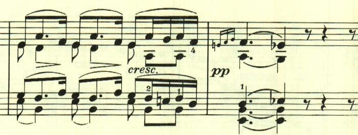

# ベートーヴェン ピアノソナタ第11番 第2楽章

<iframe height="175" width="100%" title="Media player" src="https://embed.music.apple.com/us/album/piano-sonata-no-11-in-b-flat-major-op-22-ii-adagio/1268209323?i=1268209515&amp;itscg=30200&amp;itsct=music_box_player&amp;ls=1&amp;app=music&amp;mttnsubad=1268209515&amp;theme=auto" id="embedPlayer" style="border:0;border-radius:12px;width:100%;height:175px;max-width:660px" sandbox="allow-forms allow-popups allow-same-origin allow-scripts allow-top-navigation-by-user-activation" allow="autoplay *; encrypted-media *; clipboard-write"></iframe>

第1楽章が長調なら、多くのケースで第2楽章は短調となるところだが、第11番では、第2楽章は引き続き長調で、のどかな雰囲気となっている。また第2楽章としては珍しくソナタ形式となっている。

青空を見上げるような爽やかなテーマが続く。

そして、そよ風のようなテーマで終始明い雰囲気が続く。

展開部は短調で開始し、最初のテーマが展開されていく。

再現部。

最後までのどかな雰囲気が続いて終わる。

楽譜引用はヘンレ版。
