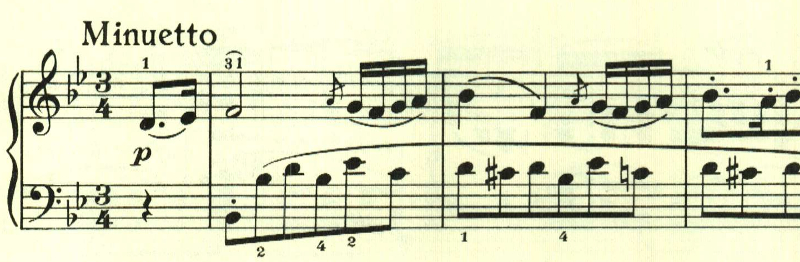

# ベートーヴェン ピアノソナタ第11番 第3楽章

<iframe height="175" width="100%" title="Media player" src="https://embed.music.apple.com/us/album/piano-sonata-no-11-in-b-flat-major-op-22-iii-menuetto/1268209323?i=1268209516&amp;itscg=30200&amp;itsct=music_box_player&amp;ls=1&amp;app=music&amp;mttnsubad=1268209516&amp;theme=auto" id="embedPlayer" style="border:0;border-radius:12px;width:100%;height:175px;max-width:660px" sandbox="allow-forms allow-popups allow-same-origin allow-scripts allow-top-navigation-by-user-activation" allow="autoplay *; encrypted-media *; clipboard-write"></iframe>

第1, 2楽章に続いて、第3楽章も長調が続く。11番は古典的な4楽章のソナタで3楽章にはメヌエットが配置されている。

最初のテーマが繰り返された後は、二重音を使用したテーマが現れる。

中間部は、高速なスケールを主体とした短調で対比が見事。

楽譜引用はヘンレ版。
