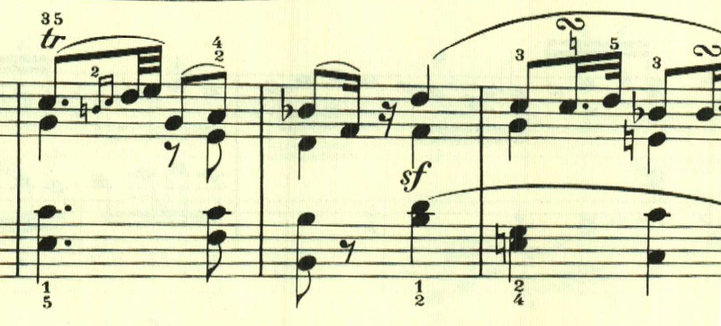
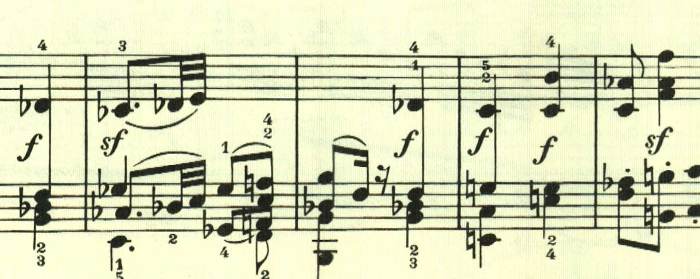
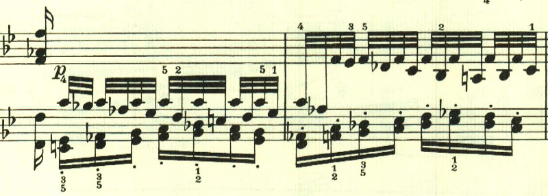
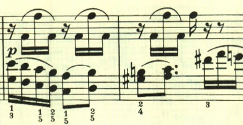

# ベートーヴェン ピアノソナタ第11番 第4楽章

<iframe height="175" width="100%" title="Media player" src="https://embed.music.apple.com/us/album/piano-sonata-no-11-in-b-flat-major-op-22-iv-rondo-allegretto/1268209323?i=1268209517&amp;itscg=30200&amp;itsct=music_box_player&amp;ls=1&amp;app=music&amp;mttnsubad=1268209517&amp;theme=auto" id="embedPlayer" sandbox="allow-forms allow-popups allow-same-origin allow-scripts allow-top-navigation-by-user-activation" allow="autoplay *; encrypted-media *; clipboard-write" style="border: 0px; border-radius: 12px; width: 100%; height: 175px; max-width: 660px;"></iframe>

ソナタ第11番は、第4楽章まで全て長調。曲は即興的なテーマで始まる。

2つ目のテーマも長調。

展開部は2つ目のテーマが短調で展開される。

もこもとしたテーマが続く。

再現部は最初のテーマが左手に表れる。

ここは三連符による変化。

最後まで明い雰囲気で終わる。
