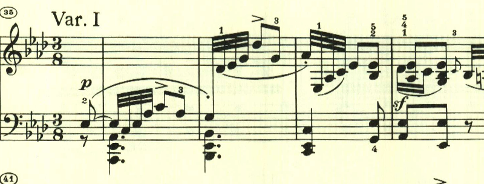
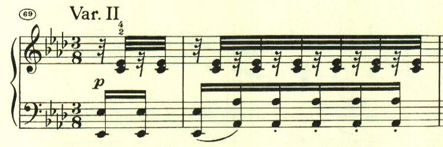
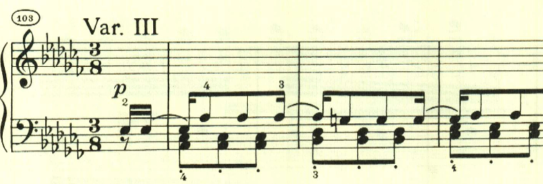

# ベートーヴェン ピアノソナタ第12番 第1楽章

<iframe allow="autoplay *; encrypted-media *;" sandbox="allow-forms allow-popups allow-same-origin allow-scripts allow-top-navigation-by-user-activation" style="padding:0;width:660px;height:150px;max-width:100%;border:none;overflow:hidden;background:transparent;" src="https://embed.music.apple.com/us/album/piano-sonata-no-12-in-flat-major-op-26-i-andante-con/1272663034?i=1272663038"></iframe>

ソナタ第12番も、11番に引き続き4楽章構成だが、これまでと異なり、変奏曲、スケルツォ、葬送行進曲、ロンドという新しい構成が試みられている。
第1楽章は、暖かな日射しと快い風を思わせるような、明いテーマで始まる。

第1変奏は、アルペジオ主体。

第2変奏は、右と左とで互いに奏しながら、左手でテーマを奏する。

第3変奏は、短調となるが、やはり右と左とで、ずれて奏される。

第4変奏は、テーマの3音を2音に減らす変化が加えられる。

第5変奏は、3連符で流れるような変奏。

最後に、終わりを告げるテーマが表れて静かに終わる。

楽譜引用はヘンレ版。
