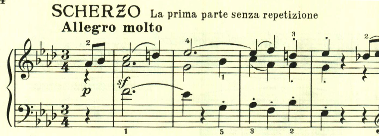
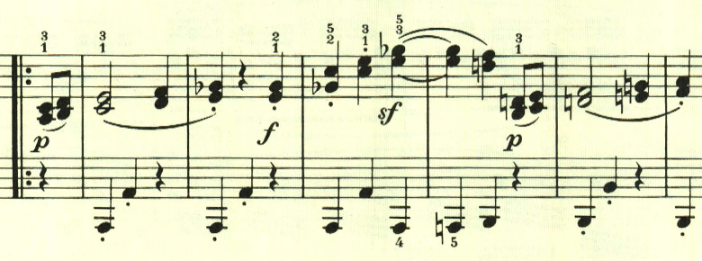
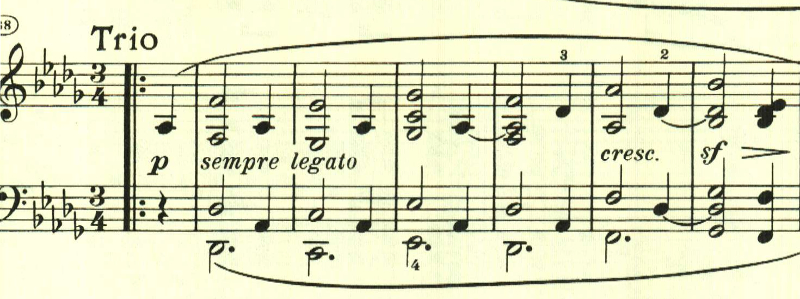

# ベートヴェン ピアノ・ソナタ 第12番 第2楽章

<iframe allow="autoplay *; encrypted-media *;" frameborder="0" height="150" sandbox="allow-forms allow-popups allow-same-origin allow-scripts allow-top-navigation-by-user-activation" src="https://embed.music.apple.com/us/album/piano-sonata-no-12-in-flat-major-op-26-ii-scherzo-allegro/1272663034?i=1272663702" width="660"></iframe>

第2楽章はスケルツォ。元気の良いテーマが様々に展開される。

様々なテーマを繰り出すこれまでのソナタと違い、最初のテーマが何度も使われる。

ここでは左手にテーマが現れる。

トリオも長調が続くが、和音ベースの柔らかなもの。

楽譜引用はヘンレ版。
