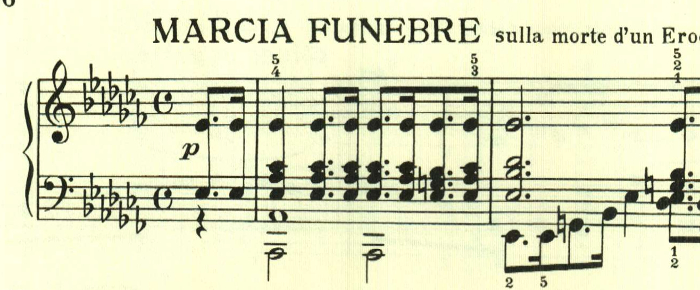
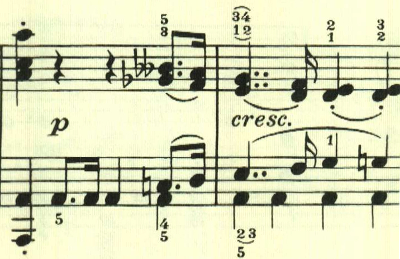

# ベートーヴェン ピアノ・ソナタ 第12番 第3楽章

<iframe allow="autoplay *; encrypted-media *;" frameborder="0" height="150" sandbox="allow-forms allow-popups allow-same-origin allow-scripts allow-top-navigation-by-user-activation" src="https://embed.music.apple.com/us/album/piano-sonata-no-12-in-flat-major-op-26-iii-marcia-funebre/1272663034?i=1272663703&app=music" width="660"></iframe>

第3楽章は葬送行進曲。ある英雄の死を悼むと記載がある。重厚な和音の進行で始まる。この和音の解釈が演奏上は結構迷う。上から2つ目の音を旋律として見るのか、一番上の音を旋律として見るのか、箇所によってそれらを変移させるのか。

中間部は、長調になって大音量となり、日本人的には、これが葬送行進曲なのか？ と不思議になるが、英雄の死を悼む時には太鼓や弔砲などが奏されるので、その表現なのかもしれない。

中間部が終わると、同じテーマが繰り返される。あまり展開は無く、粛々と進む。

最後に終わりを告げるテーマが現れて静かに終わる。

楽譜引用はヘンレ版から。
