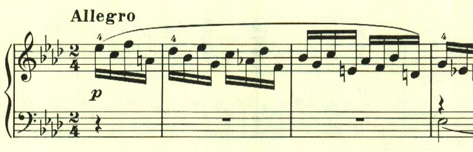

# ベートーヴェン ピアノ・ソナタ 第12番 第4楽章

<iframe allow="autoplay *; encrypted-media *;" frameborder="0" height="150" sandbox="allow-forms allow-popups allow-same-origin allow-scripts allow-top-navigation-by-user-activation" src="https://embed.music.apple.com/us/album/piano-sonata-no-12-in-a-flat-major-op-26-iv-allegro/1272663034?i=1272663704&app=music" width="660"></iframe>

ベートーヴェンのピアノソナタには、時折、このような調性が薄く速い、即興的な楽章が登場する。明確なテーマは無く、混沌とした中にメロディがたまに顔を見せる、印象的な楽章だ。

左手にテーマらしきものがあるが、発展するわけでもなく消え入ってしまう。

ここもリズムが印象的だが、発展性は無い。

中間部も、相変わらずテーマらしきものは無く、押し流されるように進んでいく。

最後に、終わりを告げるテーマが現われて静かに終わる。

</>

楽譜引用はヘンレ版から。
