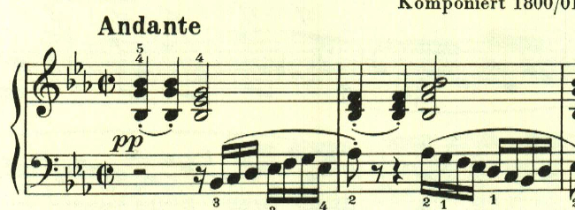
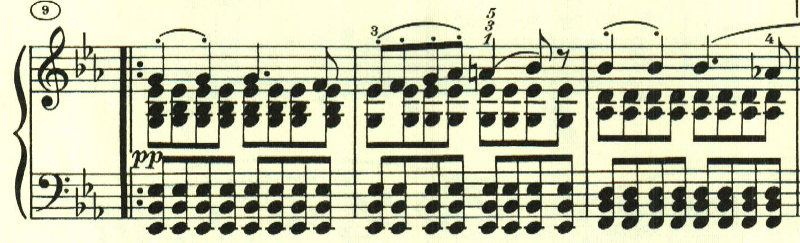
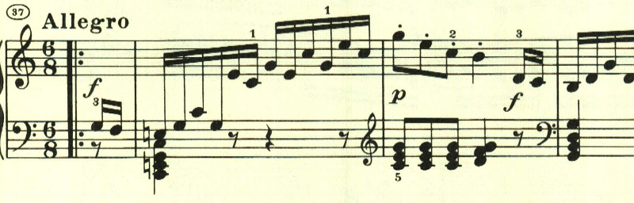
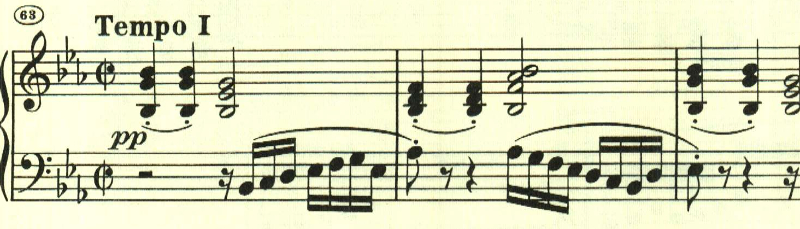

# ベートーヴェン ピアノ・ソナタ 第13番 第1楽章

<iframe allow="autoplay *; encrypted-media *;" frameborder="0" height="150" sandbox="allow-forms allow-popups allow-same-origin allow-scripts allow-top-navigation-by-user-activation" src="https://embed.music.apple.com/us/album/piano-sonata-no-13-in-e-flat-major-op-27-no-1-quasi/1272663034?i=1272663705&app=music" width="660"></iframe>

ここから「幻想曲風ソナタ(SONATA QUASI UNA FANTASIA)」というタイトルが付くようになる。
霧の中をゆっくり進むような、和音を主としたテーマで始まる。

和音の中にテーマが浮かぶ。

ここも和音主体であるが、少し雰囲気が変わる。

ここで突如として高速なパッセージとなるが、やはりアルペジオ主体で和音へのこだわりがある。

最初のテーマが繰り返されて終わる。

楽譜引用はヘンレ版から。
