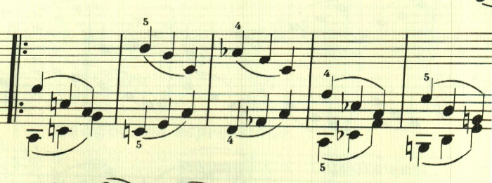
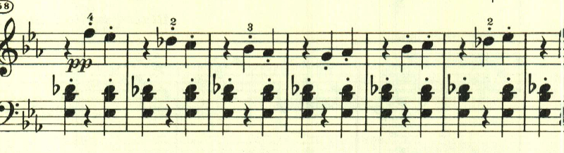

# ベートーヴェン ピアノ・ソナタ 第13番 第2楽章

<iframe allow="autoplay *; encrypted-media *;" frameborder="0" height="150" sandbox="allow-forms allow-popups allow-same-origin allow-scripts allow-top-navigation-by-user-activation" src="https://embed.music.apple.com/us/album/piano-sonata-no-13-in-e-flat-major-op-27-no-1-quasi/1272663034?i=1272663706&app=music" width="660"></iframe>

第2楽章は、アルペジオ主体の速い楽章。

極めて単純なパッセージを縦横無尽に展開する様は見事だ。

中間部も非常に単純なパッセージで見事な効果を上げている。

再度最初のテーマが繰り返される。最後は、8分音符分のずれを伴って劇的に終わる。

楽譜引用はヘンレ版から。
