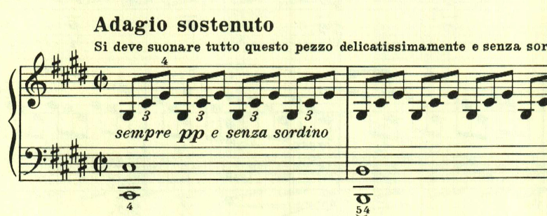
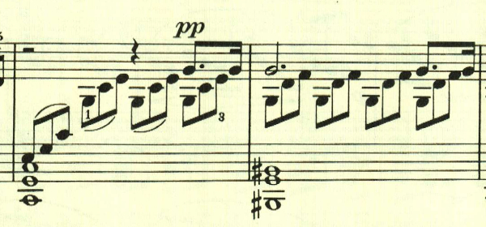
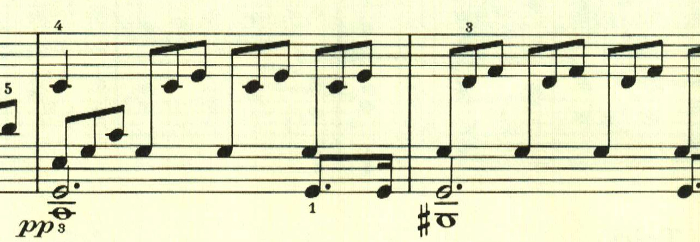

# ベートーヴェン ピアノ・ソナタ第14番 第1楽章 「月光」

<iframe allow="autoplay *; encrypted-media *;" frameborder="0" height="150" sandbox="allow-forms allow-popups allow-same-origin allow-scripts allow-top-navigation-by-user-activation" src="https://embed.music.apple.com/us/album/piano-sonata-no-14-in-c-sharp-minor-op-27-no-2-moonlight/937943891?i=937943920&app=music" width="660"></iframe>

ベートーヴェンのピアノ・ソナタの中で最も有名な曲の1つ。アルペジオ主体で明確なメロディが無く、強いて言えば左手の進行がメロディらしき存在。

そしてppで微かな印象的な符点の音型が浮かび上がる。

曲は、特に大きな展開もなくずっと同じ雰囲気が続く。最後は左手に同じ音型が現れる。

楽譜の引用はヘンレ版。
