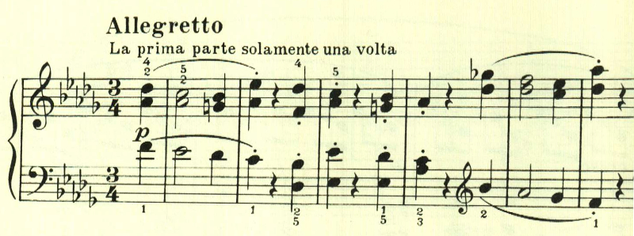
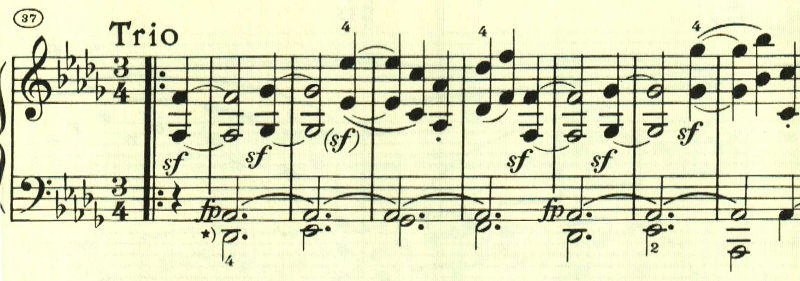

# ベートーヴェン ピアノ・ソナタ第14番 第2楽章

<iframe allow="autoplay *; encrypted-media *;" frameborder="0" height="150" sandbox="allow-forms allow-popups allow-same-origin allow-scripts allow-top-navigation-by-user-activation" src="https://embed.music.apple.com/us/album/piano-sonata-no-14-in-c-sharp-minor-op-27-no-2-moonlight/937943891?i=937943921&app=music" width="660"></iframe>

第2楽章は、無理に明るく振る舞っているかのような短かな楽章。

トリオも長調で、あまり雰囲気は変わらないが、後半はやるせないよう諦めているような感じのテーマとなる。da capoで戻って最初のテーマが繰り返されて終わる。

楽譜引用はヘンレ版
