# ベートーヴェン ピアノ・ソナタ第14番「月光」

## 第1楽章 

<iframe allow="autoplay *; encrypted-media *;" frameborder="0" height="150" sandbox="allow-forms allow-popups allow-same-origin allow-scripts allow-top-navigation-by-user-activation" src="https://embed.music.apple.com/us/album/piano-sonata-no-14-in-c-sharp-minor-op-27-no-2-moonlight/937943891?i=937943920&app=music" width="660"></iframe>

ベートーヴェンのピアノ・ソナタの中で最も有名な曲の1つ。アルペジオ主体で明確なメロディが無く、強いて言えば左手の進行がメロディらしき存在。

そしてppで微かな印象的な符点の音型が浮かび上がる。

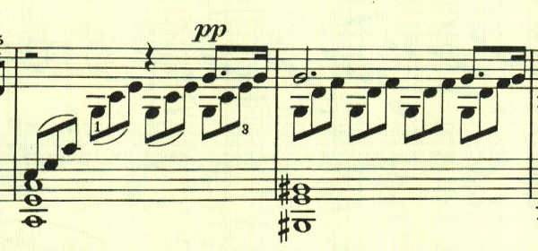

曲は、特に大きな展開もなくずっと同じ雰囲気が続く。最後は左手に同じ音型が現れる。

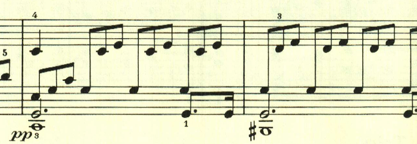

## 第2楽章

<iframe allow="autoplay *; encrypted-media *;" frameborder="0" height="150" sandbox="allow-forms allow-popups allow-same-origin allow-scripts allow-top-navigation-by-user-activation" src="https://embed.music.apple.com/us/album/piano-sonata-no-14-in-c-sharp-minor-op-27-no-2-moonlight/937943891?i=937943921&app=music" width="660"></iframe>

第2楽章は、無理に明るく振る舞っているかのような短かな楽章。

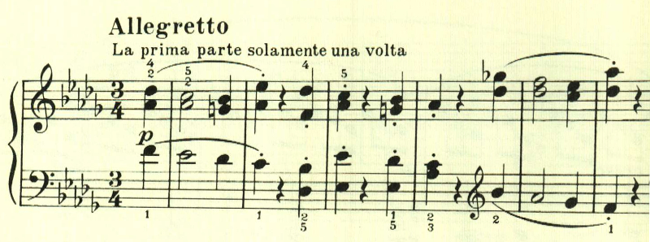

トリオも長調で、あまり雰囲気は変わらないが、後半はやるせないよう諦めているような感じのテーマとなる。da capoで戻って最初のテーマが繰り返されて終わる。

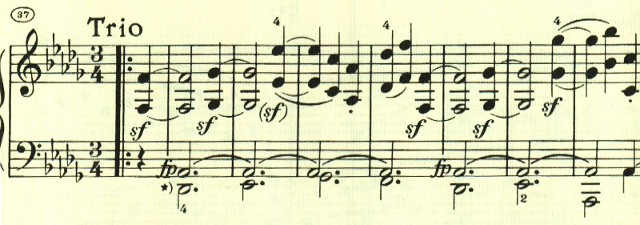

## 第3楽章

<iframe allow="autoplay *; encrypted-media *;" frameborder="0" height="150" sandbox="allow-forms allow-popups allow-same-origin allow-scripts allow-top-navigation-by-user-activation" src="https://embed.music.apple.com/us/album/piano-sonata-no-14-in-c-sharp-minor-op-27-no-2-moonlight/937943891?i=937943922&app=music" width="660"></iframe>

第1楽章から第3楽章まで、静かでゆっくりとした楽章から、激しく速い楽章へと昇華していく。これまでの曲には珍しく最後の楽章も、きっちりとしたソナタ形式で書かれている。
最初のテーマはアルペジオ主体で旋律らしきものは無いが、最後の2つの和音の前の音にだけスフォルツァンド指定が付くことで、大きな緊張感を作り出してている。

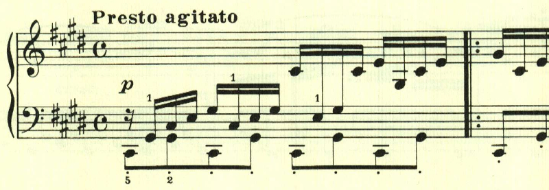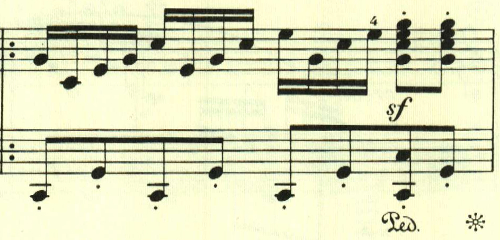

次のテーマは最初のテーマと対照的に旋律的だ。

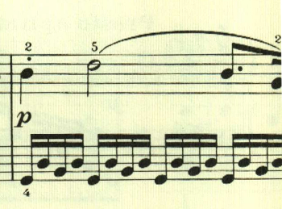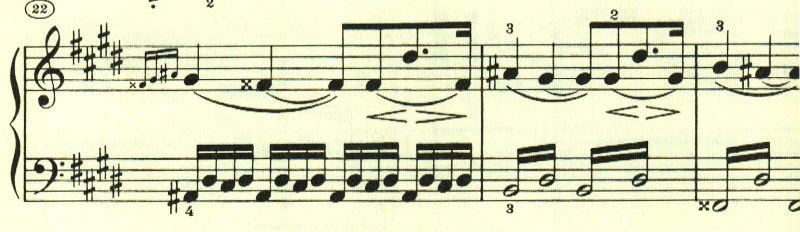

ここも和音を主体に、大きな緊張感を作り出すことに成功している。

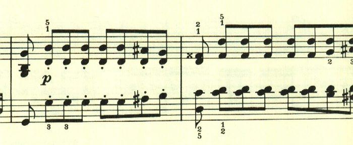

展開部は長調で始まるものの、緊張が緩和することは無い。

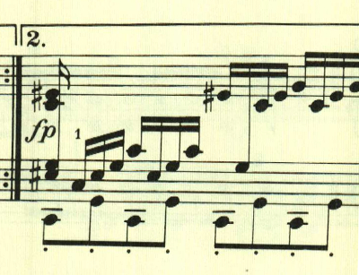

ここでは左手にテーマが現れる。

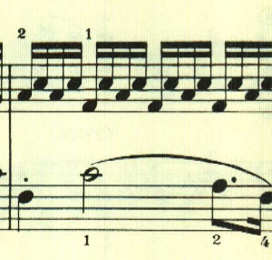

最初のテーマが繰り返された後、アルペジオ主体のクライマックス。

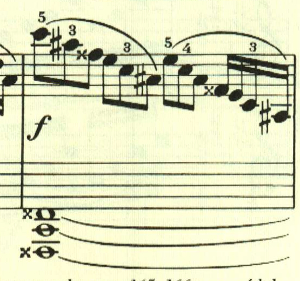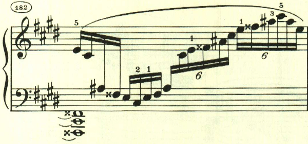

そしてアダージョを経て、嘆くかのようにテーマが繰り返されて劇的に終わる。この曲は、第1楽章に絶大な人気があるが、やはり第3楽章が傑作だろう。

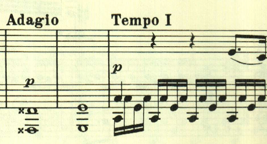

楽譜引用はヘンレ版

