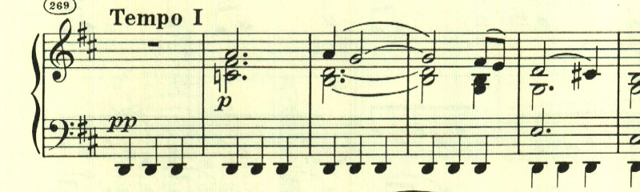

# ベートーヴェン ピアノ・ソナタ 第15番 第1楽章

<iframe allow="autoplay *; encrypted-media *;" frameborder="0" height="150" sandbox="allow-forms allow-popups allow-same-origin allow-scripts allow-top-navigation-by-user-activation" src="https://embed.music.apple.com/us/album/piano-sonata-no-15-in-d-major-op-28-i-allegro/1272663034?i=1272663709&app=music" width="660"></iframe>

15番は、通奏低音が特徴的な曲で一般に「田園」という通称で知られる。

この曲も初期の曲と同じく、色々なテーマが登場する。

特徴的な2つ目のテーマは最初は幻想的な雰囲気の中に浮かび上がるかのようで、メロディーらしきものが見当たらない。

その後にテーマが現れる。

展開部も長調のままで開始する。

展開部は、最初と違って新しいテーマは使われずに、提示されたテーマが繰り返し使われる。

再現部。

一通り再現が終わった後に、もう一度最初のテーマが現れて終わる。

楽譜引用はヘンレ版。
