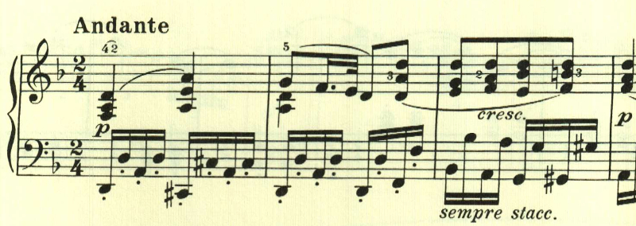
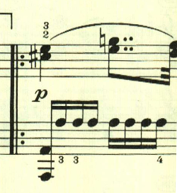
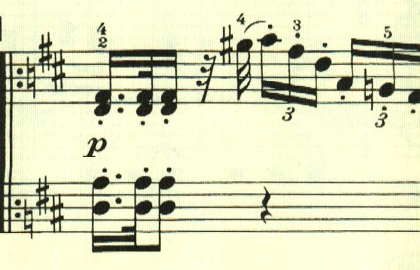

# ベートーヴェン ピアノ・ソナタ第15番 第2楽章

<iframe allow="autoplay *; encrypted-media *;" frameborder="0" height="150" sandbox="allow-forms allow-popups allow-same-origin allow-scripts allow-top-navigation-by-user-activation" src="https://embed.music.apple.com/us/album/piano-sonata-no-15-in-d-major-op-28-ii-andante/1272663034?i=1272663710&app=music" width="660"></iframe>

15番では4楽章に戻っており、第2楽章はスタカートの左手の上に憂鬱なテーマが進む。

2つ目のテーマも、短調のまま継続。

ここからは長調となりリズミカルなテーマが展開される。

最初のテーマが再現される。

ここからはテーマが16分音符で変奏され、最後は静かに終わる。

楽譜引用は、ヘンレ版から。
