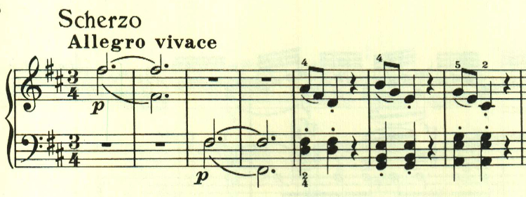
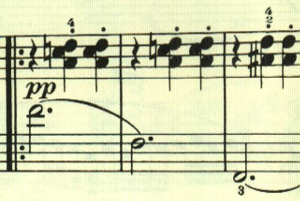
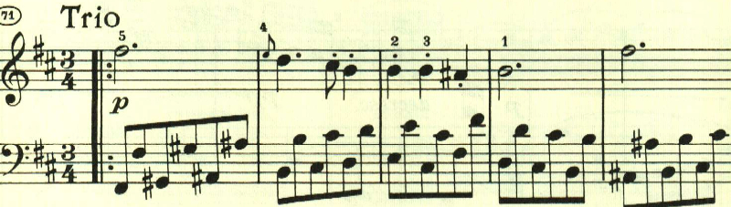

# ベートーヴェン ピアノ・ソナタ第15番 第3楽章

<iframe allow="autoplay *; encrypted-media *;" frameborder="0" height="150" sandbox="allow-forms allow-popups allow-same-origin allow-scripts allow-top-navigation-by-user-activation" src="https://embed.music.apple.com/us/album/piano-sonata-no-15-in-d-major-op-28-iii-scherzo-allegro-vivace/1272663034?i=1272663711&app=music" width="660"></iframe>

第3楽章にはオーソドックスにスケルツォが配置されている。
この楽章は、単純な音型が基礎になっているものの、あまり展開はされない。最初はオクターブで進む単純な音型。

ここから左手に移る。

曲全体は、複合三部形式となっていて、短調のトリオが続く。

D.C.で最初に戻り、最初のテーマが繰り返されて終わる。

楽譜引用はヘンレ版から。
