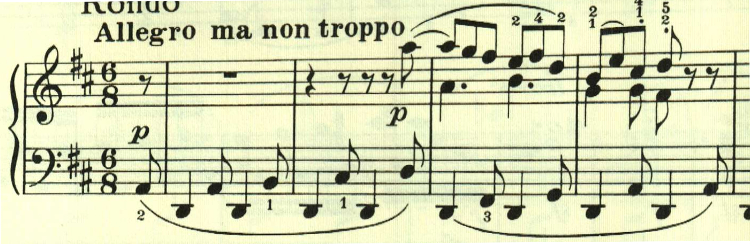
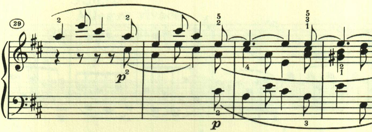
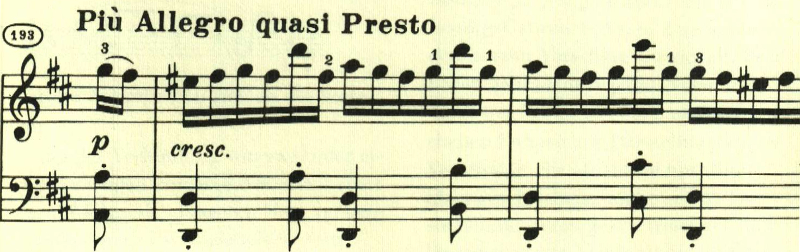

# ベートーヴェン ピアノ・ソナタ 第15番 第4楽章

<iframe allow="autoplay *; encrypted-media *;" frameborder="0" height="150" sandbox="allow-forms allow-popups allow-same-origin allow-scripts allow-top-navigation-by-user-activation" src="https://embed.music.apple.com/us/album/piano-sonata-no-15-in-d-major-op-28-iv-rondo-allegro/1272663034?i=1272663712&app=music" width="660"></iframe>

第4楽章はRondo。第1楽章と同じくニ長調であることもあり、曲全体で同じ雰囲気が持続している。Rondoとあるものの、左手で奏される八分音符と四分音符の組み合わせが、様々に展開されていく。

最後に終わりを告げるPrestoが現れるが、左手にはやはり最初のテーマが登場する。

楽譜の引用はヘンレ版。
