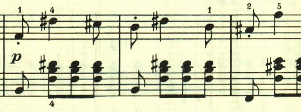

# ベートーヴェン ピアノ・ソナタ 第16番 第1楽章

<iframe allow="autoplay *; encrypted-media *;" frameborder="0" height="150" style="width:660px;max-width:100%;overflow:hidden;background:transparent;" sandbox="allow-forms allow-popups allow-same-origin allow-scripts allow-top-navigation-by-user-activation" src="https://embed.music.apple.com/us/album/piano-sonata-no-16-in-g-major-op-31-no-1-i-allegro-vivace/1272663034?i=1272663713&app=music"></iframe>

第1楽章は、元気に溢れる楽章。最初はリズミカルな主題と和音の連打で始まる。

そしてアルペジオの繰り返し。

元気いっぱいのテーマ。

このテーマも短調になるがエネルギーに溢れている。

ここで一区切り。

この楽章はソナタ形式だが、主題の展開には乏しく新しく幻想的なテーマが現れる。

再現部の後、終わりを告げるテーマが現れて終わる。

楽譜の引用はヘンレ版。
