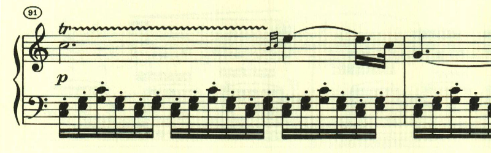
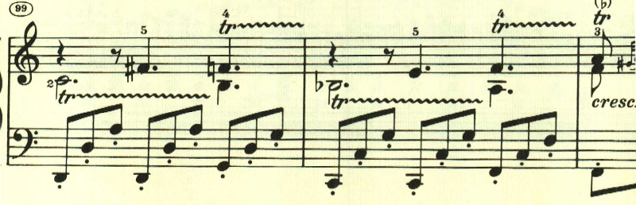

# ベートーヴェン ピアノ・ソナタ 第16番 第2楽章

<iframe allow="autoplay *; encrypted-media *;" frameborder="0" height="150" style="width:100%;max-width:660px;overflow:hidden;background:transparent;" sandbox="allow-forms allow-popups allow-same-origin allow-scripts allow-top-navigation-by-user-activation" src="https://embed.music.apple.com/us/album/piano-sonata-no-16-in-g-major-op-31-no-1-ii-adagio-grazioso/1272663034?i=1272663714&app=music"></iframe>

第2楽章は、トリルと速いパッセージが特徴的な楽章。

曲はロンド・ソナタ形式。2つ目に現れるテーマは最初のテーマと対照的に不安を感じさせるもの。

最初のテーマに戻る。

次のテーマは短調で始まるものの、すぐに長調に戻る。

元気いっぱいのテーマが展開される。

最初のテーマに戻る。左手が和音となる変化が加えられている。

ここで再度2番目のテーマが変化を伴って現れる。

再度最初のテーマ。

最後に最初のテーマが展開され、終わりを告げる。

楽譜引用はヘンレ版。
