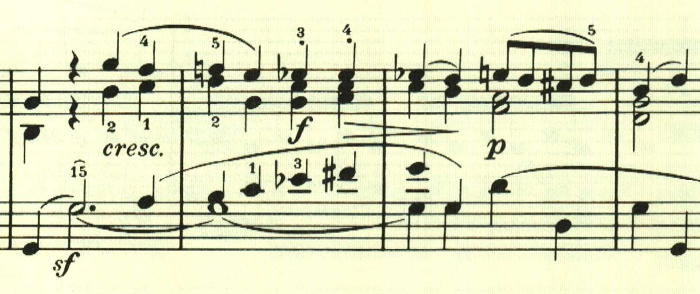
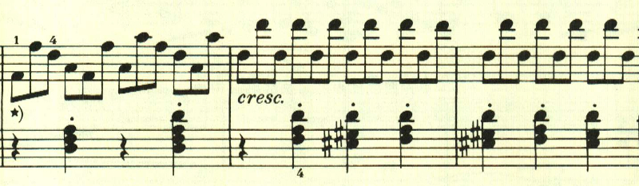

# ベートーヴェン ピアノ・ソナタ第16番 第3楽章

<iframe allow="autoplay *; encrypted-media *;" frameborder="0" height="150" style="width:100%;max-width:660px;overflow:hidden;background:transparent;" sandbox="allow-forms allow-popups allow-same-origin allow-scripts allow-top-navigation-by-user-activation" src="https://embed.music.apple.com/us/album/piano-sonata-no-16-in-g-major-op-31-no-1-iii-rondo-allegretto/1272663034?i=1272663715&app=music"></iframe>

第3楽章はロンドと記載されているが、かなり自由な構成になっている。テーマは民謡風な素朴なもの。

2つ目のテーマも素朴で、ダンスを踊っているかのようだ。

テーマの提示が終わった後は、経過句のような音型が現れるが、ここもノリノリだ。

再度、最初のテーマ。

ここは短調に転じる。

再度最初のテーマが現れるが、アダージョとなる。

これでもかと、最初のテーマが使われる。

最後はリズミカルな和音の連打で終わる。

楽譜引用はヘンレ版から。
