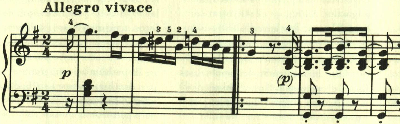
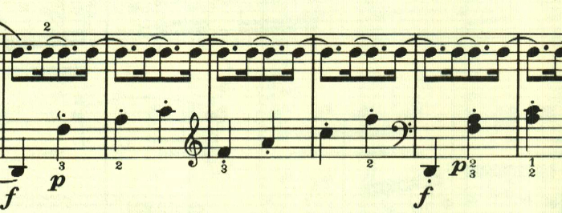
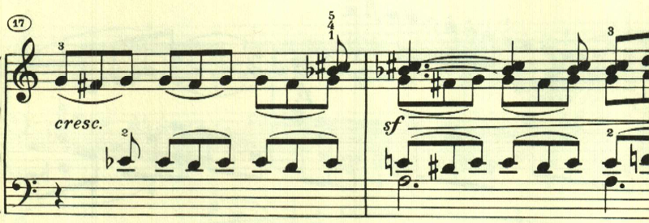

# ベートーヴェン ピアノ・ソナタ 第16番

## 第1楽章

<iframe allow="autoplay *; encrypted-media *;" frameborder="0" height="150" style="width:660px;max-width:100%;overflow:hidden;background:transparent;" sandbox="allow-forms allow-popups allow-same-origin allow-scripts allow-top-navigation-by-user-activation" src="https://embed.music.apple.com/us/album/piano-sonata-no-16-in-g-major-op-31-no-1-i-allegro-vivace/1272663034?i=1272663713&app=music"></iframe>

第1楽章は、元気に溢れる楽章。最初はリズミカルな主題と和音の連打で始まる。

そしてアルペジオの繰り返し。

元気いっぱいのテーマ。

このテーマも短調になるがエネルギーに溢れている。

ここで一区切り。

この楽章はソナタ形式だが、主題の展開には乏しく新しく幻想的なテーマが現れる。

再現部の後、終わりを告げるテーマが現れて終わる。

## 第2楽章

<iframe allow="autoplay *; encrypted-media *;" frameborder="0" height="150" style="width:100%;max-width:660px;overflow:hidden;background:transparent;" sandbox="allow-forms allow-popups allow-same-origin allow-scripts allow-top-navigation-by-user-activation" src="https://embed.music.apple.com/us/album/piano-sonata-no-16-in-g-major-op-31-no-1-ii-adagio-grazioso/1272663034?i=1272663714&app=music"></iframe>

第2楽章は、トリルと速いパッセージが特徴的な楽章。

曲はロンド・ソナタ形式。2つ目に現れるテーマは最初のテーマと対照的に不安を感じさせるもの。

最初のテーマに戻る。

次のテーマは短調で始まるものの、すぐに長調に戻る。

元気いっぱいのテーマが展開される。

最初のテーマに戻る。左手が和音となる変化が加えられている。

ここで再度2番目のテーマが変化を伴って現れる。

再度最初のテーマ。

最後に最初のテーマが展開され、終わりを告げる。

## 第3楽章

<iframe allow="autoplay *; encrypted-media *;" frameborder="0" height="150" style="width:100%;max-width:660px;overflow:hidden;background:transparent;" sandbox="allow-forms allow-popups allow-same-origin allow-scripts allow-top-navigation-by-user-activation" src="https://embed.music.apple.com/us/album/piano-sonata-no-16-in-g-major-op-31-no-1-iii-rondo-allegretto/1272663034?i=1272663715&app=music"></iframe>

第3楽章はロンドと記載されているが、かなり自由な構成になっている。テーマは民謡風な素朴なもの。

2つ目のテーマも素朴で、ダンスを踊っているかのようだ。

テーマの提示が終わった後は、経過句のような音型が現れるが、ここもノリノリだ。

再度、最初のテーマ。

ここは短調に転じる。

再度最初のテーマが現れるが、アダージョとなる。

これでもかと、最初のテーマが使われる。

最後はリズミカルな和音の連打で終わる。

楽譜引用はヘンレ版から。

