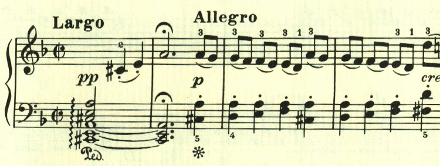

# ベートーヴェン ピアノ・ソナタ 第17番 第1楽章

<iframe allow="autoplay *; encrypted-media *;" frameborder="0" height="150" style="width:100%;max-width:660px;overflow:hidden;background:transparent;" sandbox="allow-forms allow-popups allow-same-origin allow-scripts allow-top-navigation-by-user-activation" src="https://embed.music.apple.com/us/album/piano-sonata-no-17-in-d-major-op-31-no-2-tempest-i-largo-allegro/937943891?i=937943923&app=music"></iframe>

有名な「テンペスト・ソナタ」。テンポの変化、リズムの変化の自由さ、そして独特の緊張感が印象的なソナタ。
前半のアルペジオが「静」なら、2つの八分音符がスラーでつながれた音型は大きな緊張を伴った「動」でその対照が見事。

左手の力強いアルペジオで始まり、右手が不安なテーマが答える。この受け答えのパターンは、第8番ソナタの第1楽章に似ている。

ここも2つの八分音符がスラーでつながれた音型が用いられて大きな緊張感を作りだしている。

これらの音型は新しいものだが、やはり独特の緊張感、焦燥を生み出している。

展開部。最初のテーマが長調で展開される。

そして2つ目のテーマが展開される。通例なら対照的な穏かな曲調の展開が予想されるところだが、この楽章全体を通じて緊張感が解かれることはない。

再現部に入る。

と、突如全く新しい音型が即興的にアレグロで始まるが、すぐに元のテーマに戻る。

最後は静かなアルペジオで消えるように終わる。

楽譜引用はヘンレ版から。
