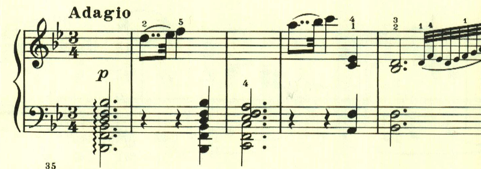
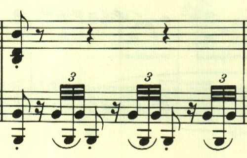
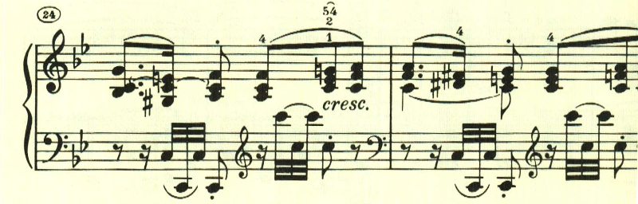
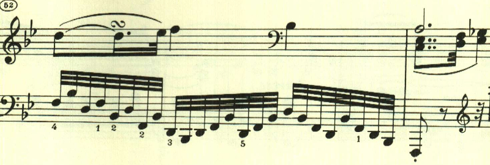

# ベートーヴェン ピアノ・ソナタ第17番 第2楽章

<iframe allow="autoplay *; encrypted-media *;" frameborder="0" height="150" style="width:100%;max-width:660px;overflow:hidden;background:transparent;" sandbox="allow-forms allow-popups allow-same-origin allow-scripts allow-storage-access-by-user-activation allow-top-navigation-by-user-activation" src="https://embed.music.apple.com/us/album/piano-sonata-no-17-in-d-major-op-31-no-2-tempest-ii-adagio/937943891?i=937943924&app=music"></iframe>

第2楽章もアルペジオで始まる。複符点音符が特徴的な雨上がりのような明いテーマで始まる。

この3連符は楽章を通じて繰り返し使われる。

この楽章は大きな展開はなく、明いテーマが繰り返し変化を伴って繰り返されて、のんびりとした雰囲気で静かに終わる。

楽譜引用はヘンレ版から。
