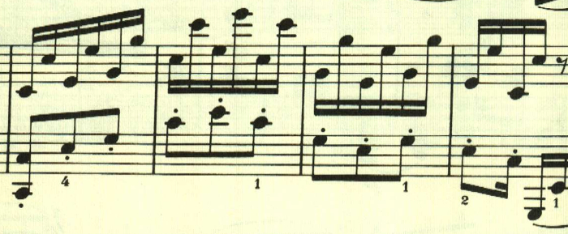
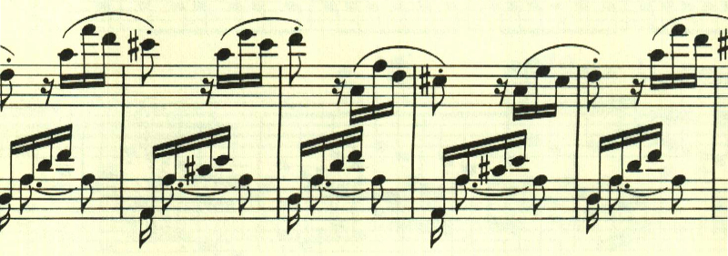

# ベートーヴェン ピアノ・ソナタ第17番 第3楽章

<iframe allow="autoplay *; encrypted-media *;" frameborder="0" height="150" style="width:100%;max-width:660px;overflow:hidden;background:transparent;" sandbox="allow-forms allow-popups allow-same-origin allow-scripts allow-storage-access-by-user-activation allow-top-navigation-by-user-activation" src="https://embed.music.apple.com/us/album/piano-sonata-no-17-in-d-major-op-31-no-2-tempest-iii-allegretto/937943891?i=937943925&app=music"></iframe>

第3楽章は、何かに追い立てられるかのような旋律が、徹底的に展開される。最初のテーマは右手に対して左手が呼応する音型で構成される。

単純なアルペジオだが長調で入ることで絶大な効果を上げている。

このF-Eの音型は最初のテーマと並んで、曲全体で重要な役割を果たしている。

ここも単純な音型だが印象的だ。

展開部は、最初のテーマが徹底的に展開される。

再現部。

再現部の後に、若干の続きがある。長調となったり短調となったりと不安な緊張感を与える。

霧の中に消え入るよう。

再度最初のテーマが変化を伴って現れる。

最初のテーマが最後を告げて、消えいるように終わる。

楽譜の引用はヘンレ版から。
