# ベートーヴェン ピアノ・ソナタ 第17番

## 第1楽章

<iframe allow="autoplay *; encrypted-media *;" frameborder="0" height="150" style="width:100%;max-width:660px;overflow:hidden;background:transparent;" sandbox="allow-forms allow-popups allow-same-origin allow-scripts allow-top-navigation-by-user-activation" src="https://embed.music.apple.com/us/album/piano-sonata-no-17-in-d-major-op-31-no-2-tempest-i-largo-allegro/937943891?i=937943923&app=music"></iframe>

有名な「テンペスト・ソナタ」。テンポの変化、リズムの変化の自由さ、そして独特の緊張感が印象的なソナタ。
前半のアルペジオが「静」なら、2つの八分音符がスラーでつながれた音型は大きな緊張を伴った「動」でその対照が見事。

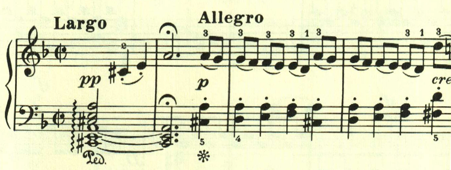

左手の力強いアルペジオで始まり、右手が不安なテーマが答える。この受け答えのパターンは、第8番ソナタの第1楽章に似ている。

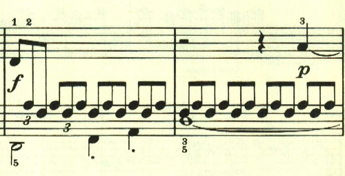
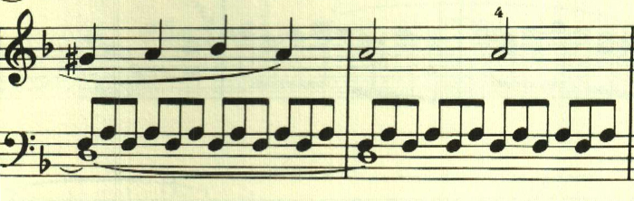

ここも2つの八分音符がスラーでつながれた音型が用いられて大きな緊張感を作りだしている。

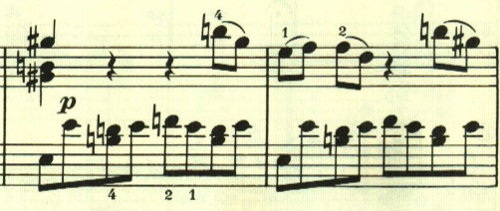

これらの音型は新しいものだが、やはり独特の緊張感、焦燥を生み出している。

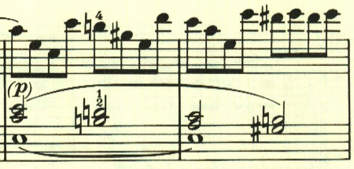

展開部。最初のテーマが長調で展開される。

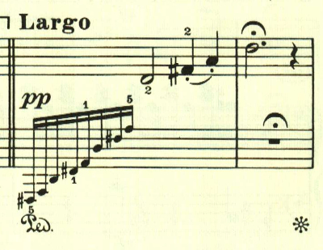

そして2つ目のテーマが展開される。通例なら対照的な穏かな曲調の展開が予想されるところだが、この楽章全体を通じて緊張感が解かれることはない。

再現部に入る。

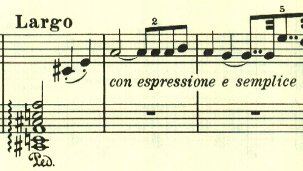

と、突如全く新しい音型が即興的にアレグロで始まるが、すぐに元のテーマに戻る。

最後は静かなアルペジオで消えるように終わる。

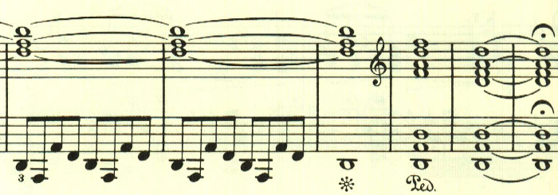

## 第2楽章

<iframe allow="autoplay *; encrypted-media *;" frameborder="0" height="150" style="width:100%;max-width:660px;overflow:hidden;background:transparent;" sandbox="allow-forms allow-popups allow-same-origin allow-scripts allow-storage-access-by-user-activation allow-top-navigation-by-user-activation" src="https://embed.music.apple.com/us/album/piano-sonata-no-17-in-d-major-op-31-no-2-tempest-ii-adagio/937943891?i=937943924&app=music"></iframe>

第2楽章もアルペジオで始まる。複符点音符が特徴的な雨上がりのような明いテーマで始まる。

この3連符は楽章を通じて繰り返し使われる。

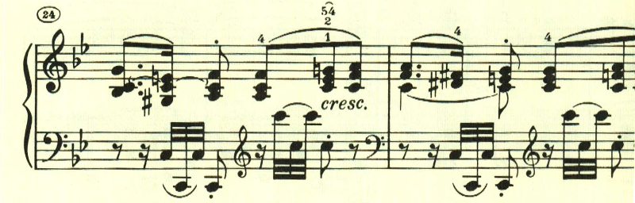

この楽章は大きな展開はなく、明いテーマが繰り返し変化を伴って繰り返されて、のんびりとした雰囲気で静かに終わる。

## 第3楽章

<iframe allow="autoplay *; encrypted-media *;" frameborder="0" height="150" style="width:100%;max-width:660px;overflow:hidden;background:transparent;" sandbox="allow-forms allow-popups allow-same-origin allow-scripts allow-storage-access-by-user-activation allow-top-navigation-by-user-activation" src="https://embed.music.apple.com/us/album/piano-sonata-no-17-in-d-major-op-31-no-2-tempest-iii-allegretto/937943891?i=937943925&app=music"></iframe>

第3楽章は、何かに追い立てられるかのような旋律が、徹底的に展開される。最初のテーマは右手に対して左手が呼応する音型で構成される。

単純なアルペジオだが長調で入ることで絶大な効果を上げている。

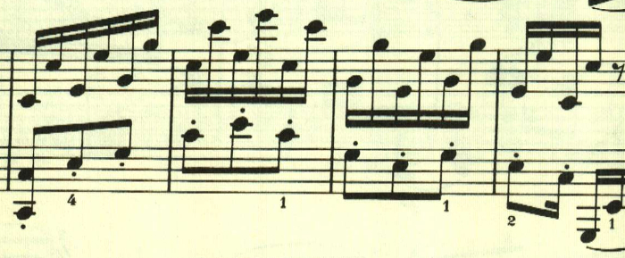

このF-Eの音型は最初のテーマと並んで、曲全体で重要な役割を果たしている。

ここも単純な音型だが印象的だ。

展開部は、最初のテーマが徹底的に展開される。

再現部。

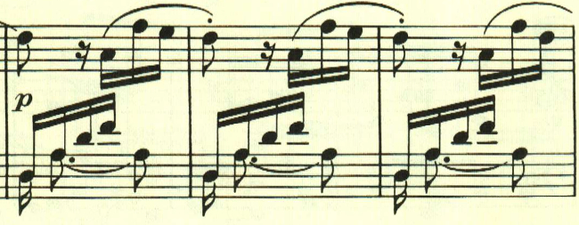

再現部の後に、若干の続きがある。長調となったり短調となったりと不安な緊張感を与える。

霧の中に消え入るよう。

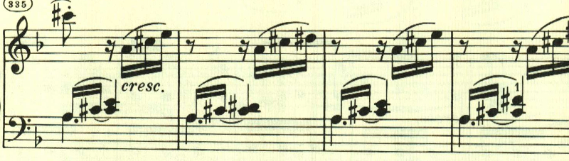

再度最初のテーマが変化を伴って現れる。

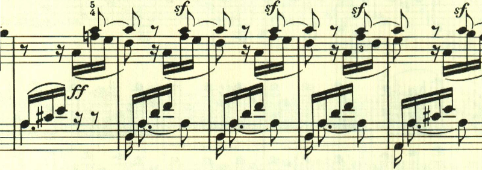

最初のテーマが最後を告げて、消えいるように終わる。

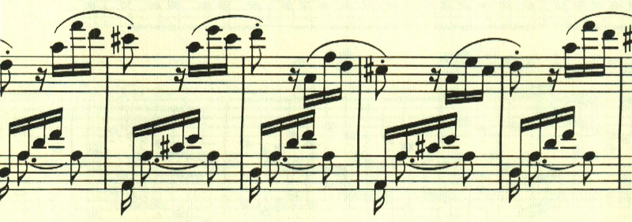

楽譜の引用はヘンレ版から。
