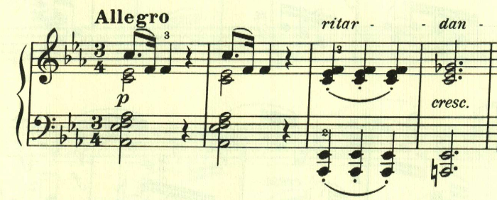
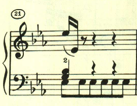
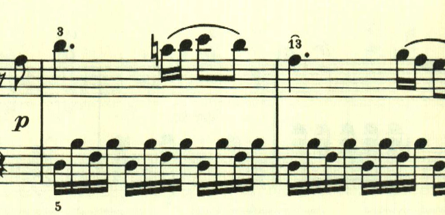
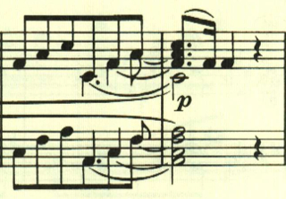
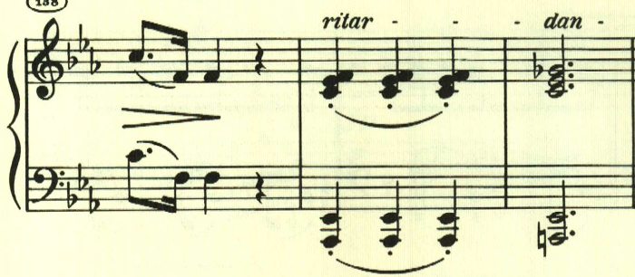

# ベートーヴェン ピアノ・ソナタ第18番第1楽章

<iframe allow="autoplay *; encrypted-media *;" frameborder="0" height="150" style="width:100%;max-width:660px;overflow:hidden;background:transparent;" sandbox="allow-forms allow-popups allow-same-origin allow-scripts allow-storage-access-by-user-activation allow-top-navigation-by-user-activation" src="https://embed.music.apple.com/us/album/piano-sonata-no-18-in-e-flat-major-op-31-i-allegro/960633853?i=960633866&app=music"></iframe>

17番までで幻想曲風ソナタはひとまず終了。18番は4楽章制の古典的なソナタへの回帰を見せているが、新しい試みも幾つか見られる。
第1楽章は、単純な音型で始まる。

この単純な音型も曲全体で何度も使われる。

この主題は旋律的で対照的だ。

展開部。2つ目の音型が主に使用される。

再現部。

楽譜引用はヘンレ版
