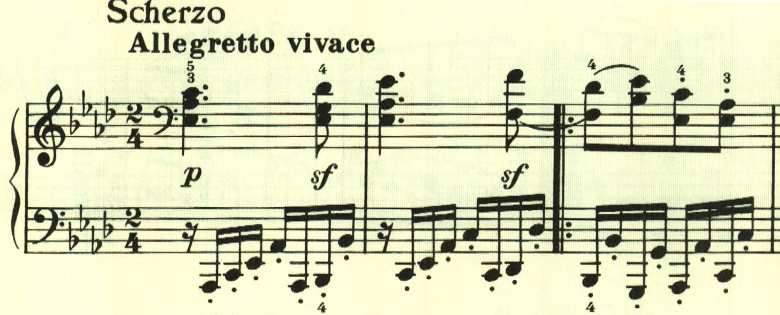
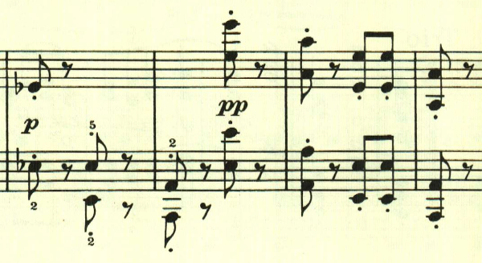

# ベートーヴェン ピアノソナタ第18番 第2楽章

<iframe allow="autoplay *; encrypted-media *;" frameborder="0" height="150" style="width:100%;max-width:660px;overflow:hidden;background:transparent;" sandbox="allow-forms allow-popups allow-same-origin allow-scripts allow-storage-access-by-user-activation allow-top-navigation-by-user-activation" src="https://embed.music.apple.com/us/album/piano-sonata-no-18-in-e-flat-major-op-31-ii-scherzo/960633853?i=960633867&app=music"></iframe>

第2楽章はこれまでの4楽章制ソナタであれば緩徐楽章が配置されるところだが、18番ではスケルツォが配置されている。スタカートが多用された軽快な走り回るかのような曲。

メロディよりもリズムとスタカートが重視されている。

最後はppで静かに終わる。

楽譜引用はヘンレ版。
