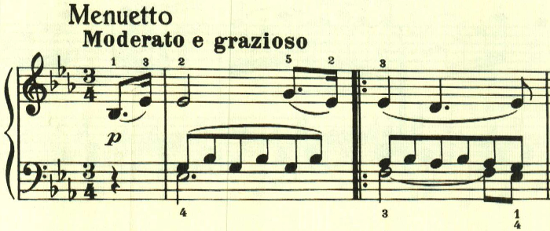
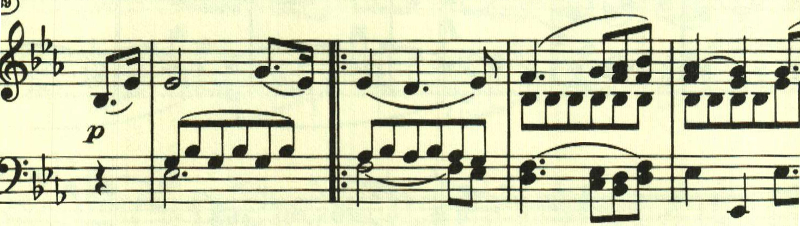

# ベートーヴェン ピアノ・ソナタ第18番第3楽章

<iframe allow="autoplay *; encrypted-media *;" frameborder="0" height="150" style="width:100%;max-width:660px;overflow:hidden;background:transparent;" sandbox="allow-forms allow-popups allow-same-origin allow-scripts allow-storage-access-by-user-activation allow-top-navigation-by-user-activation" src="https://embed.music.apple.com/us/album/piano-sonata-no-18-in-e-flat-major-op-31-iii-menuetto/960633853?i=960633868&app=music"></iframe>

第3楽章は、どこか懐しい感じのする暖かなテーマで構成されたメヌエット。

2つ目のテーマも同じ雰囲気のもの。

トリオも長調で柔らかな雰囲気が続く。

最初の2つのテーマが繰り返される。

最後にコーダが置かれ、静かに終わる。

楽譜引用はヘンレ版から。
