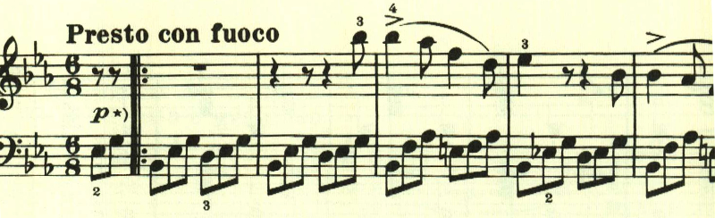
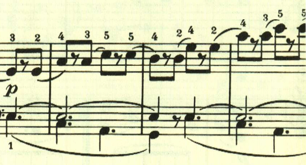

# ベートーヴェン ピアノ・ソナタ第18番 第4楽章

<iframe allow="autoplay *; encrypted-media *;" frameborder="0" height="150" style="width:100%;max-width:660px;overflow:hidden;background:transparent;" sandbox="allow-forms allow-popups allow-same-origin allow-scripts allow-storage-access-by-user-activation allow-top-navigation-by-user-activation" src="https://embed.music.apple.com/us/album/piano-sonata-no-18-in-e-flat-major-op-31-iv-presto-con-fuoco/960633853?i=960633869&app=music"></iframe>

第4楽章は、即興的なメロディの走り回っているかのような速い楽章。どのメロディも旋律というよりはリズムが特徴的だ。

このリズムは曲全体を通して繰り返し用いられる。

展開部。2番目のテーマのリズムが繰り返し用いられる。

再現部。

最後は、最初のテーマが繰り返されて終わる。

楽譜引用はヘンレ版から。
