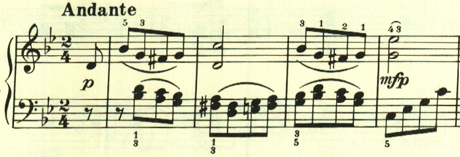
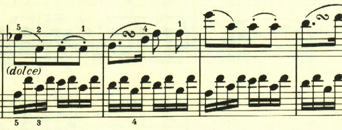
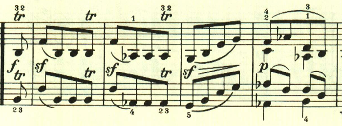
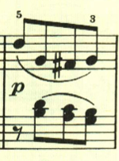
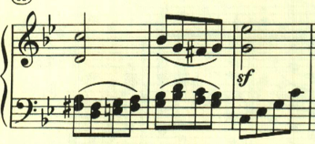
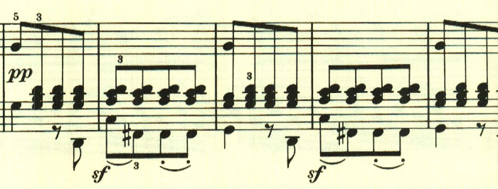

# ベートーヴェン ピアノ・ソナタ第19番 第1楽章

<iframe allow="autoplay *; encrypted-media *;" frameborder="0" height="150" style="width:100%;max-width:660px;overflow:hidden;background:transparent;" sandbox="allow-forms allow-popups allow-same-origin allow-scripts allow-storage-access-by-user-activation allow-top-navigation-by-user-activation" src="https://embed.music.apple.com/us/album/piano-sonata-no-19-in-g-minor-op-49-no-1-i-andante/960633853?i=960634118&app=music"></iframe>

作品49の2曲は、どちらも2楽章しかない規模の小さな作品。第1楽章は憂鬱なテーマで始める。

リズミカルな2つ目のテーマ。

展開部。意表をついて2つ目のテーマの出だしが展開される。

再現部。

最後は、2つ目のテーマが左手に現れて静かに終わる。

楽譜引用はヘンレ版から。
