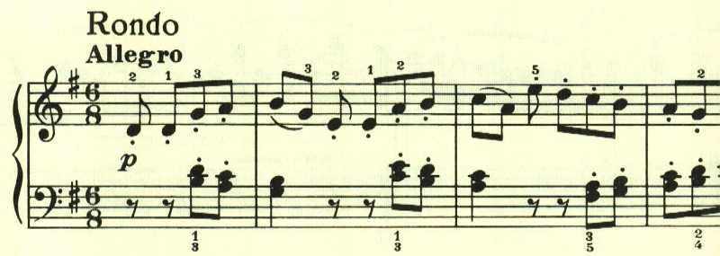
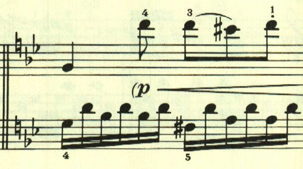
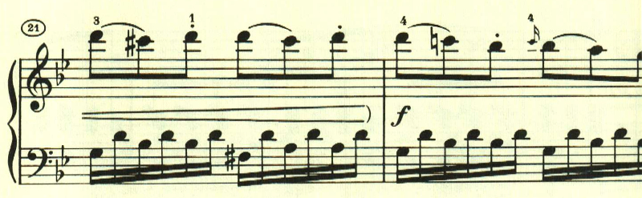
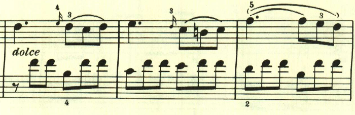
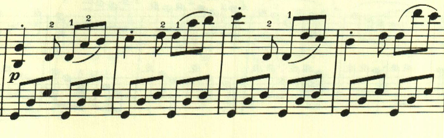

# ベートーヴェン ピアノ・ソナタ第19番 第2楽章

<iframe allow="autoplay *; encrypted-media *;" frameborder="0" height="150" style="width:100%;max-width:660px;overflow:hidden;background:transparent;" sandbox="allow-forms allow-popups allow-same-origin allow-scripts allow-storage-access-by-user-activation allow-top-navigation-by-user-activation" src="https://embed.music.apple.com/us/album/piano-sonata-no-19-in-g-minor-op-49-no-1-ii-rondo/960633853?i=960634123&app=music"></iframe>

第2楽章は、軽快なリズムのかわいらしいロンド。

このテーマは曲全体を通して使われる。

ここは同じ音型で、スラーの位置が変わり長調となる。

最後は、最初のテーマに若干の変化を入れて繰り返されて終わる。

楽譜引用はヘンレ版から。
