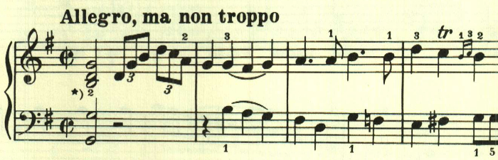
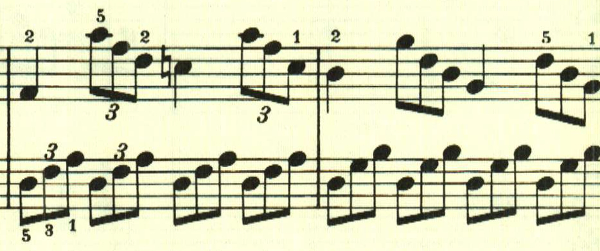
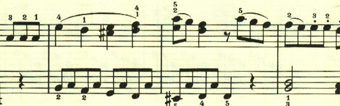
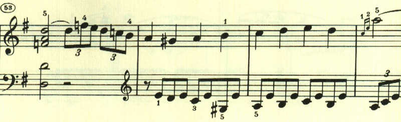
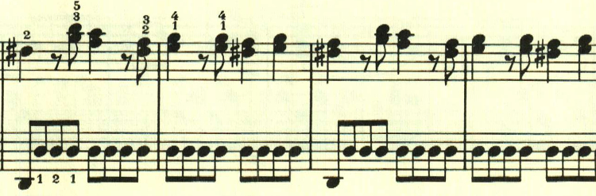
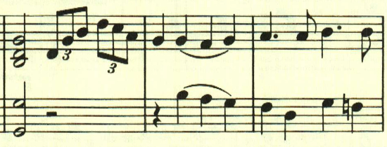

# ベートーヴェン ピアノ・ソナタ 第20番 第1楽章

<iframe allow="autoplay *; encrypted-media *;" frameborder="0" height="150" style="width:100%;max-width:660px;overflow:hidden;background:transparent;" sandbox="allow-forms allow-popups allow-same-origin allow-scripts allow-storage-access-by-user-activation allow-top-navigation-by-user-activation" src="https://embed.music.apple.com/us/album/piano-sonata-no-20-in-g-major-op-49-no-2-i-andante/961808697?i=961809069&app=music"></iframe>

第20番も、小さなソナタ。最初のテーマはアルペジオ主体な簡素なもの。

最初のテーマの変化型か。

2つ目のテーマはアルペジオとは対照的で、ニ長調に転じる。

展開部は最初のテーマが短調で奏される。

しかしテーマの展開は無く、全く新しいテーマが現れる。

すぐに再現部が現れて終わる。

楽譜引用はヘンレ版。
