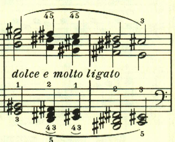
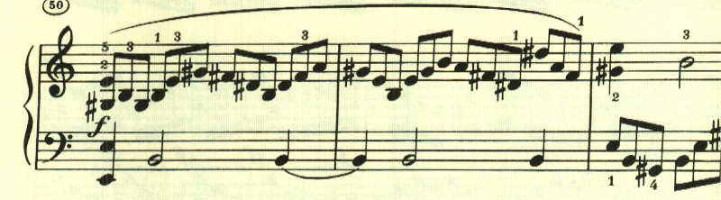
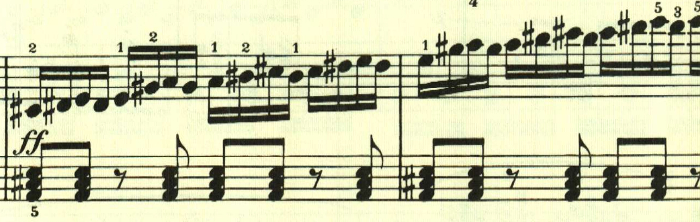
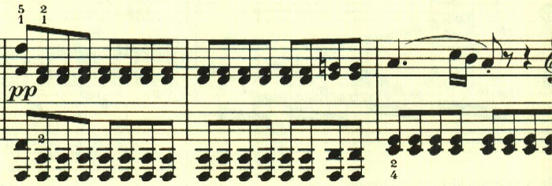
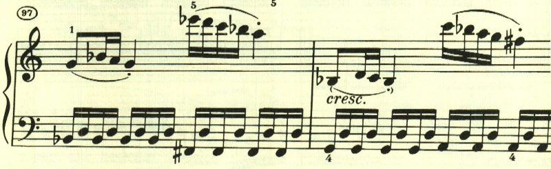
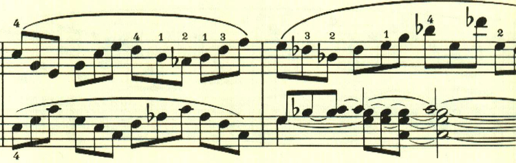
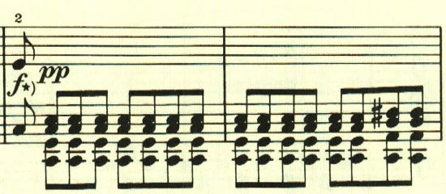
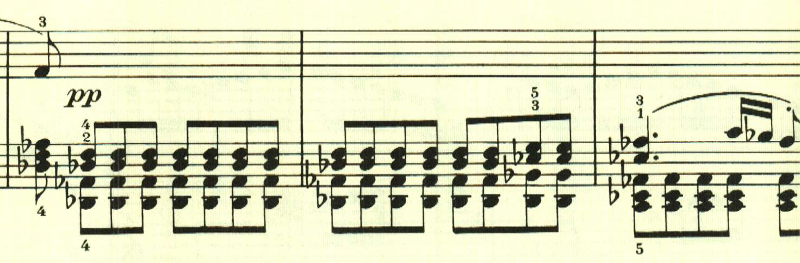

# ベートーヴェン ピアノ・ソナタ 第21番 第1楽章 「ワルトシュタイン」

<iframe allow="autoplay *; encrypted-media *;" frameborder="0" height="150" style="width:100%;max-width:660px;overflow:hidden;background:transparent;" sandbox="allow-forms allow-popups allow-same-origin allow-scripts allow-storage-access-by-user-activation allow-top-navigation-by-user-activation" src="https://embed.music.apple.com/us/album/piano-sonata-no-21-in-c-major-op-53-waldstein-i-allegro/960633853?i=960634124&app=music"></iframe>

作品49とはうって変わって大規模ソナタの復活。和音の連打の中に、小さなパッセージが現れるが、これが曲全体で重要な役割を果たす。

2つ目のテーマは、対照的な柔らかい和音の上で奏でられる。

このアルペジオは一見経過句のようだが、この後、展開部で重要な役割を果たす。

このあたりはすっかりノリノリだ。

展開部。

最初は1番目のテーマが展開される。

</>

次は3番目のテーマが展開される。

再現部。

最後にもう一度最初のテーマを用いた見せ場が用意されている。

楽譜引用はヘンレ版。
