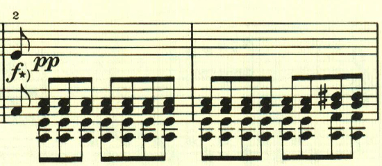

# ベートーヴェン ピアノ・ソナタ 第21番 「ワルトシュタイン」

## 第1楽章

<iframe allow="autoplay *; encrypted-media *;" frameborder="0" height="150" style="width:100%;max-width:660px;overflow:hidden;background:transparent;" sandbox="allow-forms allow-popups allow-same-origin allow-scripts allow-storage-access-by-user-activation allow-top-navigation-by-user-activation" src="https://embed.music.apple.com/us/album/piano-sonata-no-21-in-c-major-op-53-waldstein-i-allegro/960633853?i=960634124&app=music"></iframe>

作品49とはうって変わって大規模ソナタの復活。和音の連打の中に、小さなパッセージが現れるが、これが曲全体で重要な役割を果たす。

2つ目のテーマは、対照的な柔らかい和音の上で奏でられる。

このアルペジオは一見経過句のようだが、この後、展開部で重要な役割を果たす。

このあたりはすっかりノリノリだ。

展開部。

最初は1番目のテーマが展開される。

</>

次は3番目のテーマが展開される。

再現部。

最後にもう一度最初のテーマを用いた見せ場が用意されている。

## 第2楽章

<iframe allow="autoplay *; encrypted-media *;" frameborder="0" height="150" style="width:100%;max-width:660px;overflow:hidden;background:transparent;" sandbox="allow-forms allow-popups allow-same-origin allow-scripts allow-storage-access-by-user-activation allow-top-navigation-by-user-activation" src="https://embed.music.apple.com/us/album/piano-sonata-no-21-in-c-major-op-53-waldstein-ii-introduzione/960633853?i=960634125&app=music"></iframe>

このソナタの第2楽章は、もともと<a href="https://en.wikipedia.org/wiki/Andante_favori">Andante Favori</a>が配される予定だったが、友人からの助言により、現在の序奏に置き換えられたという。

序奏の後はロンド形式だが、最初に現れる左手のテーマが曲全体を通して展開され尽くす。

トリルの上に、テーマが現れてクライマックスとなる。

ロンドなので別のテーマがぐるぐると現れるものの、それはテーマと呼ぶには曖昧で、やはり最初のテーマが曲全体を支配する。

2回目の最初のテーマ。

最初のテーマが繰り返された後は短調に転じる。

しかしここでも最初のテーマが展開される。

幻想的な場面が現れるが、ここでも最初のテーマが左手に現れる。

3回目の最初のテーマ。

3回目は、1回目の流れに似ているが、遠くへ飛び立っていくかのように発展していき、最後には、やはり最初のテーマが現れる。

最後にプレスティッシモが配置されて、技巧の限りが尽くされる。

ここでも、最初のテーマへの執着が見られる。

ppで、オクターブを高速に弾くことが要求される難所。

最後の最後もやはり最初のテーマで締めくくられる。

楽譜引用はヘンレ版から。
