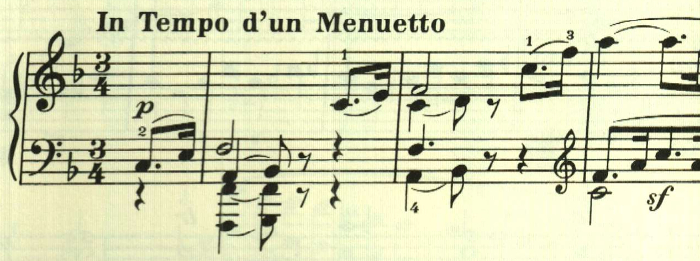
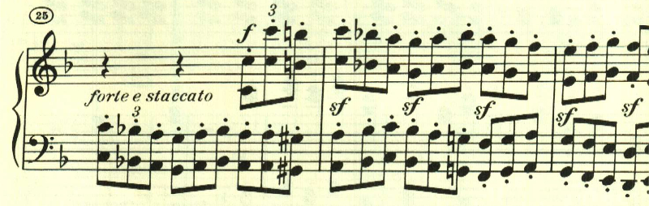
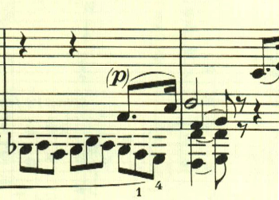
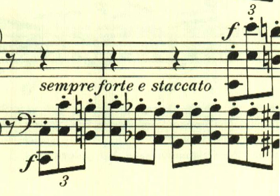
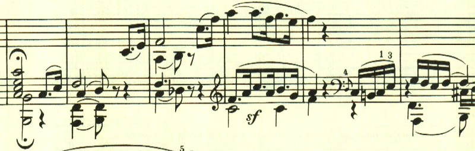
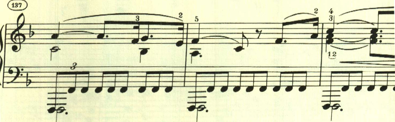

# ベートーヴェン ピアノ・ソナタ 第22番 第1楽章

<iframe allow="autoplay *; encrypted-media *;" frameborder="0" height="150" style="width:100%;max-width:660px;overflow:hidden;background:transparent;" sandbox="allow-forms allow-popups allow-same-origin allow-scripts allow-storage-access-by-user-activation allow-top-navigation-by-user-activation" src="https://embed.music.apple.com/us/album/piano-sonata-no-22-in-f-major-op-54-i-in-tempo-dun-menuetto/961808697?i=961809071&app=music"></iframe>

大作21番と23番の間にはさまれたこの曲は2楽章構成の短かなもの。第1楽章はロンド形式を基本にしている。ゆっくり歩くかのような最初のテーマ。

次のテーマは、オクターブを基本としたもので明確なメロディーらしきものが無く、リズムを主体としてる。

最初のテーマ。

2番目のテーマが繰り返されるが、最初よりも長さは短い。

再び最初のテーマに戻る。

最後に幻想的な新しいテーマが出てきて、ロンドらしくなってきたかと思うと、ここで静かに終わる。

楽譜引用はヘンレ版から。
