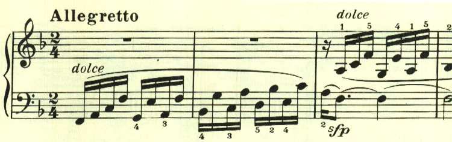
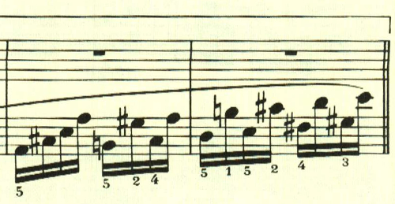
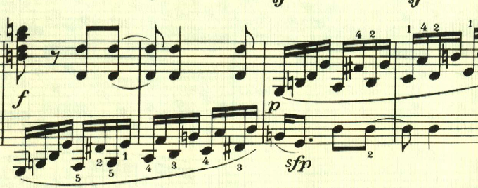
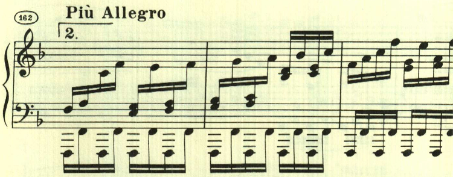
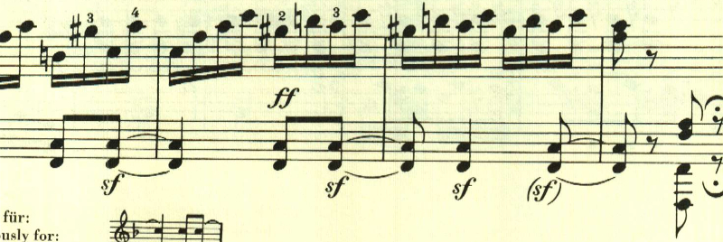

# ベートーヴェン ピアノ・ソナタ 第22番 第2楽章

<iframe allow="autoplay *; encrypted-media *;" frameborder="0" height="150" style="width:100%;max-width:660px;overflow:hidden;background:transparent;" sandbox="allow-forms allow-popups allow-same-origin allow-scripts allow-storage-access-by-user-activation allow-top-navigation-by-user-activation" src="https://embed.music.apple.com/us/album/piano-sonata-no-22-in-f-major-op-54-ii-allegretto-piu-allegro/961808697?i=961809072&app=music"></iframe>

第2楽章は、モコモコとした速い音型で構成され、メロディーらしきものが無い。

最初のリピートが終わると、調が変わって最初の音型が現れる。

この右手に現れるリズムが、この後、曲全体で重要な役割を果たす。

最後にPiu Allegroとなって最初の音型が現れて、曲の終わりを告げる。

最後は例のリズムが左手で繰り返されて終わる。

楽譜引用はヘンレ版。
