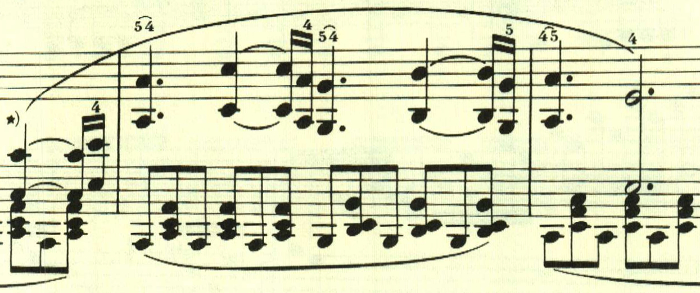
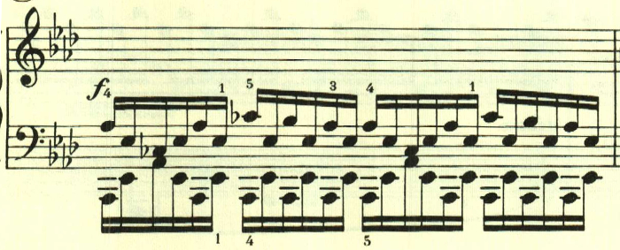
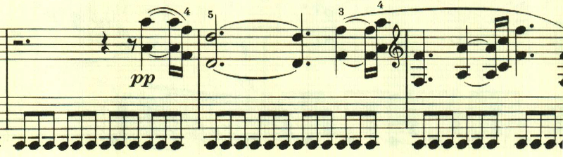

# ベートーヴェン ピアノ・ソナタ 第23番「熱情」 第1楽章

<iframe allow="autoplay *; encrypted-media *;" frameborder="0" height="150" style="width:100%;max-width:660px;overflow:hidden;background:transparent;" sandbox="allow-forms allow-popups allow-same-origin allow-scripts allow-storage-access-by-user-activation allow-top-navigation-by-user-activation" src="https://embed.music.apple.com/us/album/piano-sonata-no-23-in-f-minor-op-57-i-allegro-assai/961808697?i=961809073&app=music"></iframe>

最も有名なソナタの1つ。第一楽章は基本となる幾つかの音型が何度も使用される、お馴染のパターン。最初は独特なリズムを持った不気味なテーマで始まる。

その後にトリルを伴ったテーマ。この音型は、第2楽章の最初のテーマに似ている。

そして、運命の動機。このテーマも曲全体で何度も用いられる。

長調になって暖かなテーマが現れるが、実際は最初のテーマの変形。

16分音符の激しいテーマ。

展開部。最初のテーマが徹底的に展開される。

左手の八分音符の連打の上に最初のテーマが再現され、独特の緊張感を与える。

ここからアルペジオ主体で自由に激情がひとしきり表現される。

ここからアレグロに戻り、ffで運命の動機が奏されて、楽章の最後を飾る。

最初のテーマが繰り返されて静かに終わる。

楽譜引用はヘンレ版。
