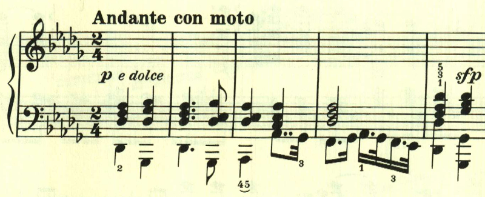
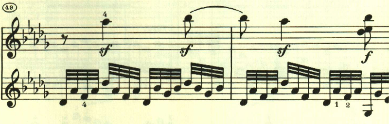
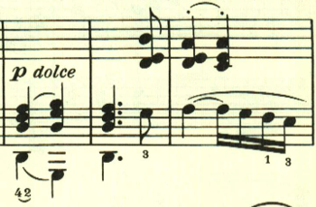
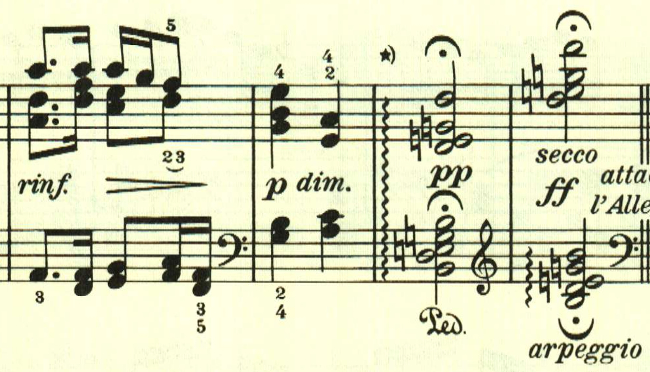
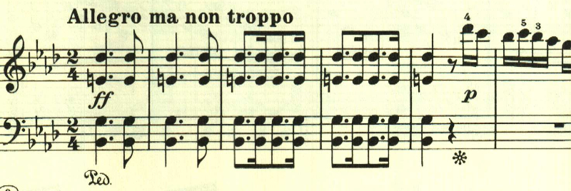
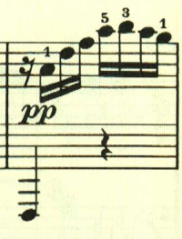
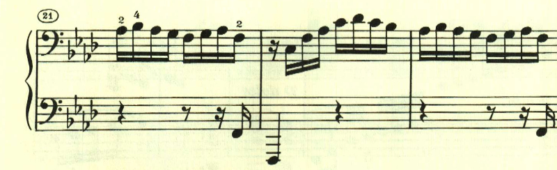
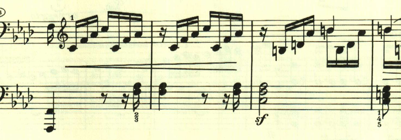
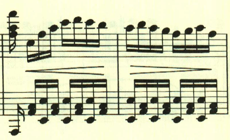
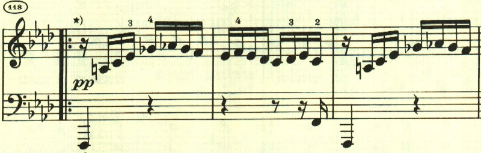

# ベートーヴェン ピアノ・ソナタ 第23番「熱情」 第2, 3楽章

<iframe allow="autoplay *; encrypted-media *;" frameborder="0" height="150" style="width:100%;max-width:660px;overflow:hidden;background:transparent;" sandbox="allow-forms allow-popups allow-same-origin allow-scripts allow-storage-access-by-user-activation allow-top-navigation-by-user-activation" src="https://embed.music.apple.com/us/album/piano-sonata-no-23-in-f-minor-op-57-ii-andante-con/961808697?i=961809074&app=music"></iframe>

第2楽章は変奏曲。
緊張感の高い2つの楽章にはさまれた、この楽章はとても暖かなテーマが変奏される。

変奏1。

変奏2

変奏3

最初のテーマに戻る。

不気味な分散和音の後、attaccaで第3楽章に流れ込む。

出だしに和音の強打があり、ppでテーマが始まり強烈な緊張感を与える。

右手で最初のテーマが奏される中で、左手側に新たな萌芽が見えてくる。

曲は、最初のテーマがこれでもかと言うほど使われる。

展開部。

右手に新たなリズムが現れて盛り上がる。

再現部の後に、最後にプレストが配置されている。最初は新たなテーマが奏される。

しかしすぐに最初のテーマの展開となる。

テーマの展開の後に、アルペジオに流れ込んで劇的に終了する。

楽譜引用はヘンレ版。
