# ベートーヴェン ピアノ・ソナタ 第23番「熱情」

## 第1楽章

<iframe allow="autoplay *; encrypted-media *;" frameborder="0" height="150" style="width:100%;max-width:660px;overflow:hidden;background:transparent;" sandbox="allow-forms allow-popups allow-same-origin allow-scripts allow-storage-access-by-user-activation allow-top-navigation-by-user-activation" src="https://embed.music.apple.com/us/album/piano-sonata-no-23-in-f-minor-op-57-i-allegro-assai/961808697?i=961809073&app=music"></iframe>

最も有名なソナタの1つ。第一楽章は基本となる幾つかの音型が何度も使用される、お馴染のパターン。最初は独特なリズムを持った不気味なテーマで始まる。

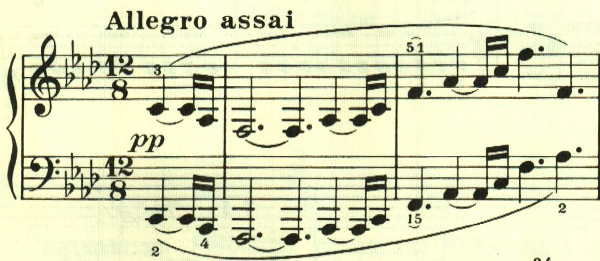

その後にトリルを伴ったテーマ。この音型は、第2楽章の最初のテーマに似ている。

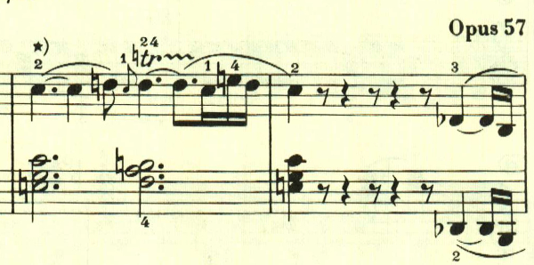

そして、運命の動機。このテーマも曲全体で何度も用いられる。

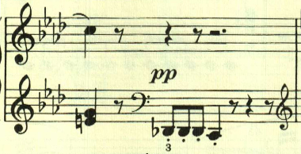

長調になって暖かなテーマが現れるが、実際は最初のテーマの変形。

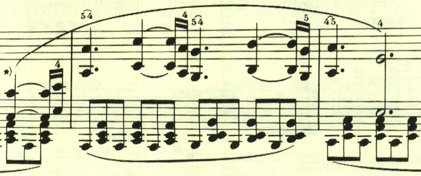

16分音符の激しいテーマ。

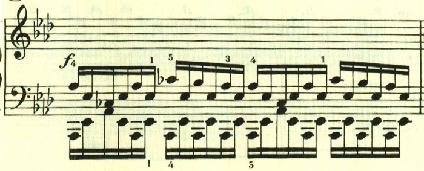

展開部。最初のテーマが徹底的に展開される。

左手の八分音符の連打の上に最初のテーマが再現され、独特の緊張感を与える。

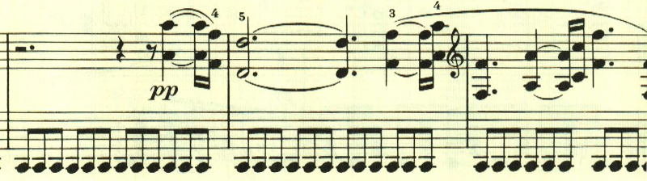

ここからアルペジオ主体で自由に激情がひとしきり表現される。

ここからアレグロに戻り、ffで運命の動機が奏されて、楽章の最後を飾る。

最初のテーマが繰り返されて静かに終わる。

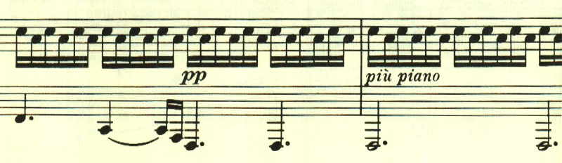

## 第2, 3楽章

<iframe allow="autoplay *; encrypted-media *;" frameborder="0" height="150" style="width:100%;max-width:660px;overflow:hidden;background:transparent;" sandbox="allow-forms allow-popups allow-same-origin allow-scripts allow-storage-access-by-user-activation allow-top-navigation-by-user-activation" src="https://embed.music.apple.com/us/album/piano-sonata-no-23-in-f-minor-op-57-ii-andante-con/961808697?i=961809074&app=music"></iframe>

第2楽章は変奏曲。
緊張感の高い2つの楽章にはさまれた、この楽章はとても暖かなテーマが変奏される。

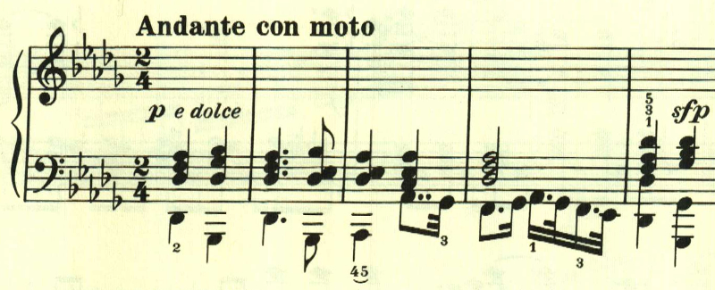

変奏1。

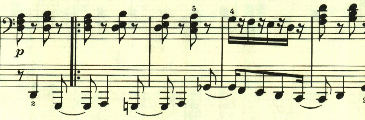

変奏2

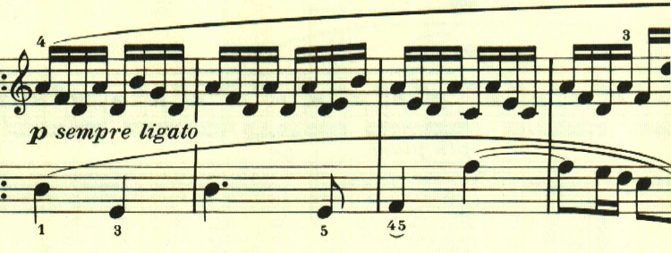

変奏3

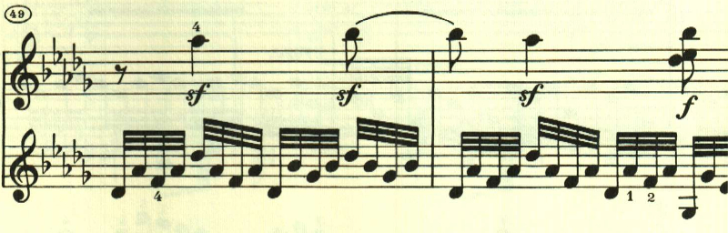

最初のテーマに戻る。

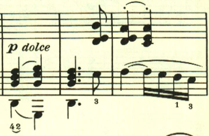

不気味な分散和音の後、attaccaで第3楽章に流れ込む。

出だしに和音の強打があり、ppでテーマが始まり強烈な緊張感を与える。

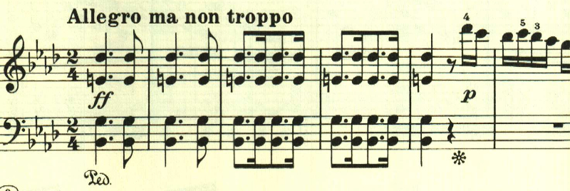

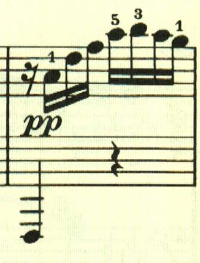

右手で最初のテーマが奏される中で、左手側に新たな萌芽が見えてくる。

曲は、最初のテーマがこれでもかと言うほど使われる。

展開部。

右手に新たなリズムが現れて盛り上がる。

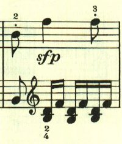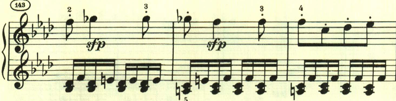

再現部の後に、最後にプレストが配置されている。最初は新たなテーマが奏される。

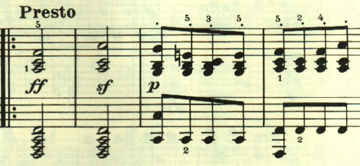

しかしすぐに最初のテーマの展開となる。

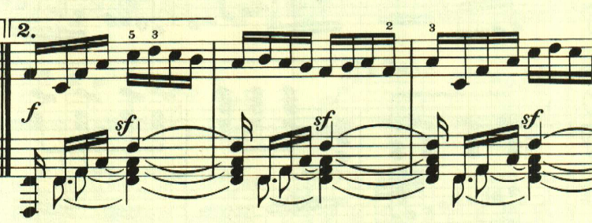

テーマの展開の後に、アルペジオに流れ込んで劇的に終了する。

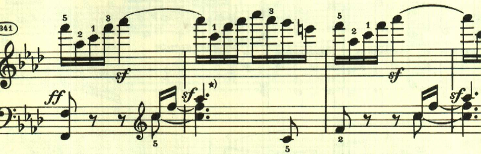

楽譜引用はヘンレ版。
