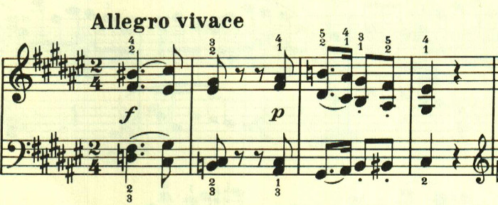
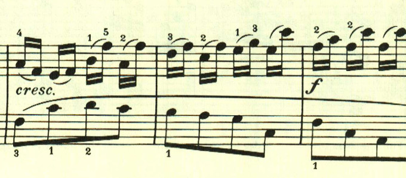
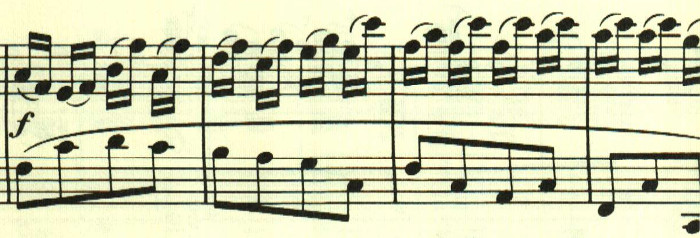

# ベートーヴェン ピアノ・ソナタ 第24番 第2楽章

<iframe allow="autoplay *; encrypted-media *;" frameborder="0" height="150" style="width:100%;max-width:660px;overflow:hidden;background:transparent;" sandbox="allow-forms allow-popups allow-same-origin allow-scripts allow-storage-access-by-user-activation allow-top-navigation-by-user-activation" src="https://embed.music.apple.com/us/album/piano-sonata-no-24-in-f-sharp-major-op-78-ii-allegro-vivace/961808697?i=961809076&app=music"></iframe>

第12番の終楽章、第22番の終楽章と、このような調性の薄い高速な楽章がたまに現れる。
1つ目のテーマは、符点を主体としたもの。

もう1つは、16分音符2つがスラーでつながった音型。この2つが自由に展開される。

この音型が曲全体で繰り返し使用される。

曲は自由な構成だが、この音型が何度も使用されるため、不思議なまとまりを感じさせる。

楽譜引用はヘンレ版から。
