# ベートーヴェン ピアノ・ソナタ 第24番

## 第1楽章

<iframe allow="autoplay *; encrypted-media *;" frameborder="0" height="150" style="width:100%;max-width:660px;overflow:hidden;background:transparent;" sandbox="allow-forms allow-popups allow-same-origin allow-scripts allow-storage-access-by-user-activation allow-top-navigation-by-user-activation" src="https://embed.music.apple.com/us/album/piano-sonata-no-24-in-f-sharp-major-op-78-i-adagio/961808697?i=961809075&app=music"></iframe>

24番は一転して小規模となり2楽章しかない。ここから27番あたりまでは、あまり規模の大きなものは書かれておらず、小規模指向になっている。

最初に夢見るような序奏が置かれている。

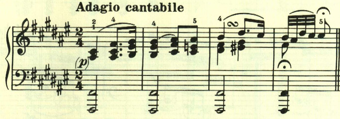

最初の符点が曲全体で繰り返し使われる。

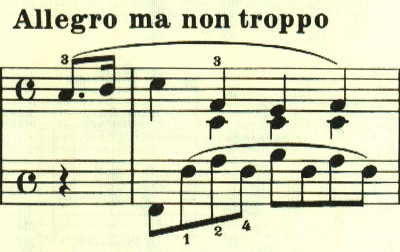

この音型も曲全体で使われる。

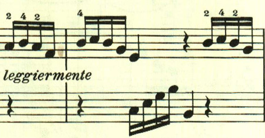

この曲では、初期の頃と同じように色々なテーマが出てくる。

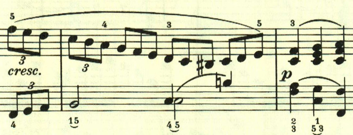

ここの右手は音型は伴奏のようだが、展開部で使われる。

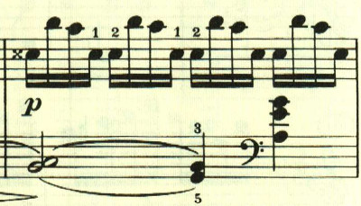

展開部は短調で始まる。展開部は非常に短かい。

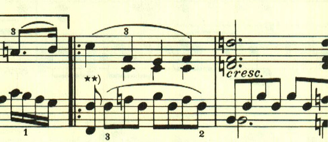

呈示部の2つの音型が組み合わされる。

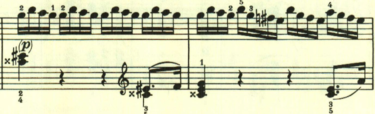

再現部。この曲は最後まで達した後、展開部から繰り返しが行われるという珍しい構成がとられている。

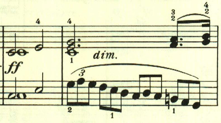

## 第2楽章

<iframe allow="autoplay *; encrypted-media *;" frameborder="0" height="150" style="width:100%;max-width:660px;overflow:hidden;background:transparent;" sandbox="allow-forms allow-popups allow-same-origin allow-scripts allow-storage-access-by-user-activation allow-top-navigation-by-user-activation" src="https://embed.music.apple.com/us/album/piano-sonata-no-24-in-f-sharp-major-op-78-ii-allegro-vivace/961808697?i=961809076&app=music"></iframe>

第12番の終楽章、第22番の終楽章と、このような調性の薄い高速な楽章がたまに現れる。
1つ目のテーマは、符点を主体としたもの。

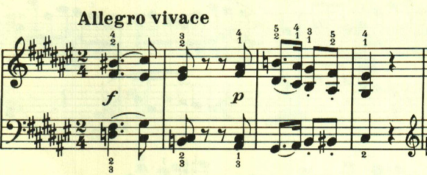

もう1つは、16分音符2つがスラーでつながった音型。この2つが自由に展開される。

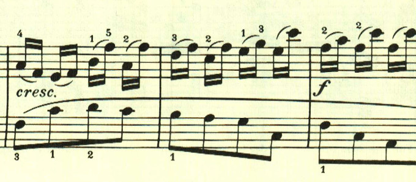

この音型が曲全体で繰り返し使用される。

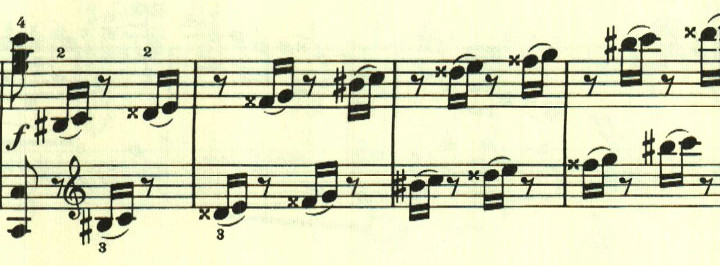

曲は自由な構成だが、この音型が何度も使用されるため、不思議なまとまりを感じさせる。

楽譜引用はヘンレ版から。
