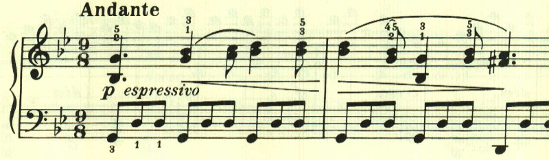
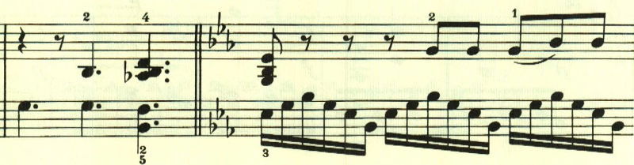

# ベートーヴェン ピアノ・ソナタ 第25番 第2楽章

<iframe allow="autoplay *; encrypted-media *;" style="width:100%;max-width:660px;overflow:hidden;background:transparent;" sandbox="allow-forms allow-popups allow-same-origin allow-scripts allow-storage-access-by-user-activation allow-top-navigation-by-user-activation" src="https://embed.music.apple.com/us/album/piano-sonata-no-25-in-g-major-op-79-ii-andante/947851407?i=947851421&app=music" height="150" frameborder="0"></iframe>

三部形式。長い階段を登っていくかのような、あるいは人生の苦悩をつづるかのようなテーマで始まる。

中間部は左手で流れるような16分音符が奏され、夢の中のような、あるいは暖かな風が吹いているかのような場面となる。

最初のテーマが繰り返される。

最初のテーマが右手に現れつつ、左手には中間部の流れる音型が組み合わされるという興味深い展開が現れて終わる。

楽譜引用はヘンレ版から。
