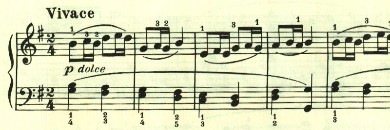
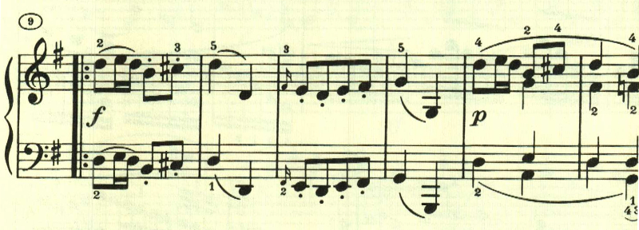

# ベートーヴェン ピアノ・ソナタ 第25番 第3楽章

<iframe allow="autoplay *; encrypted-media *;" style="width:100%;max-width:660px;overflow:hidden;background:transparent;" sandbox="allow-forms allow-popups allow-same-origin allow-scripts allow-storage-access-by-user-activation allow-top-navigation-by-user-activation" src="https://embed.music.apple.com/us/album/piano-sonata-no-25-in-g-major-op-79-iii-vivace/947851407?i=947851422&app=music" height="150" frameborder="0"></iframe>

複合三部形式。なんとも陽気な民謡のようなテーマを用いた短い楽章。

踊っているかのような、あるいはおどけているかのようなテーマ。最初のテーマと、このテーマが曲全体で使われる。

楽譜引用はヘンレ版から。
