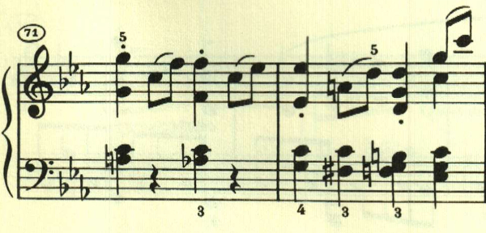
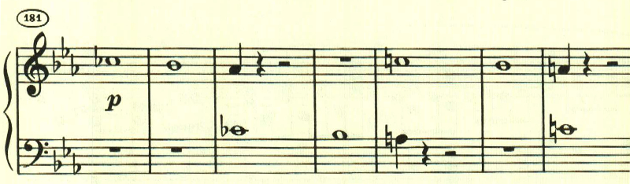

# ベートーヴェン ピアノ・ソナタ 第26番 第1楽章 「告別」

<iframe allow="autoplay *; encrypted-media *;" style="width:100%;max-width:660px;overflow:hidden;background:transparent;" sandbox="allow-forms allow-popups allow-same-origin allow-scripts allow-storage-access-by-user-activation allow-top-navigation-by-user-activation" src="https://embed.music.apple.com/us/album/piano-sonata-no-26-in-e-flat-major-op-81a-les-adieux/947851407?i=947851423&app=music" height="150" frameborder="0"></iframe>

ルドルフ大公との告別と再会をテーマにしたと言われる。曲はソナタ形式だが、最初に序奏が置かれ、最初の3音にLebewohlと書かれている。

アレグロで2つ目のテーマが奏される。

この部分はトリルが繰り返され、心の揺れ動きを表しているかのようだ。

展開部。

2つ目のテーマが左手で繰り返されるものの、あまり大きな展開は見られない。

再現部。

再現が一通り終わったあと、最初のテーマが右手と左手とで交互に奏され、2人で離れていきながら、手を振って別れを惜しんでいるかのようだ。

楽譜引用はヘンレ版から。
