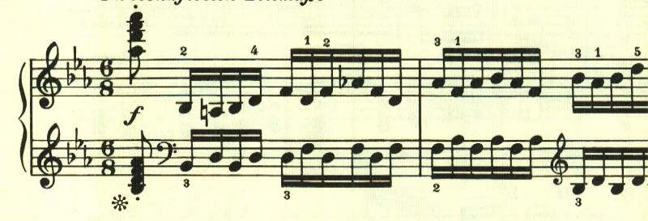
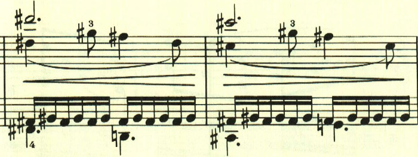

# ベートーヴェン ピアノ・ソナタ 第26番 「告別」

## 第1楽章

<iframe allow="autoplay *; encrypted-media *;" style="width:100%;max-width:660px;overflow:hidden;background:transparent;" sandbox="allow-forms allow-popups allow-same-origin allow-scripts allow-storage-access-by-user-activation allow-top-navigation-by-user-activation" src="https://embed.music.apple.com/us/album/piano-sonata-no-26-in-e-flat-major-op-81a-les-adieux/947851407?i=947851423&app=music" height="150" frameborder="0"></iframe>

ルドルフ大公との告別と再会をテーマにしたと言われる。曲はソナタ形式だが、最初に序奏が置かれ、最初の3音にLebewohlと書かれている。

アレグロで2つ目のテーマが奏される。

この部分はトリルが繰り返され、心の揺れ動きを表しているかのようだ。

展開部。

2つ目のテーマが左手で繰り返されるものの、あまり大きな展開は見られない。

再現部。

再現が一通り終わったあと、最初のテーマが右手と左手とで交互に奏され、2人で離れていきながら、手を振って別れを惜しんでいるかのようだ。

## 第2、3楽章

<iframe allow="autoplay *; encrypted-media *;" frameborder="0" height="150" style="width:100%;max-width:660px;overflow:hidden;background:transparent;" sandbox="allow-forms allow-popups allow-same-origin allow-scripts allow-storage-access-by-user-activation allow-top-navigation-by-user-activation" src="https://embed.music.apple.com/us/album/piano-sonata-no-26-in-e-flat-major-op-81a-les-adieux/947851407?i=947851424&app=music"></iframe>

第2楽章は「不在」。形式は複合2部形式。寂しげな憂鬱なテーマで始まる。

2つ目のテーマは、昔の思い出を懐しむかのような明いもの。

この2つのテーマが繰替えされた後、休み無しで第3楽章に入る。
第3楽章は「再会」。最初に序奏があり、再会の喜びが表現される。

最初のテーマは、やはり懐しむかのような。透き通ったもの。

初期の作品に見られたような、色々なテーマのパレードが始まって、再会の喜びが表現される。。

展開部。展開部は最初のテーマの展開で始まることが多いが、新しいもので始まる。

すぐに再現部となる。

最後に、アンダンテとなって、しんみりとした場面となる。

自分の家に帰ってきて、今日1日の思い出を噛み締めているかのようだ。

楽譜引用はヘンレ版から。

