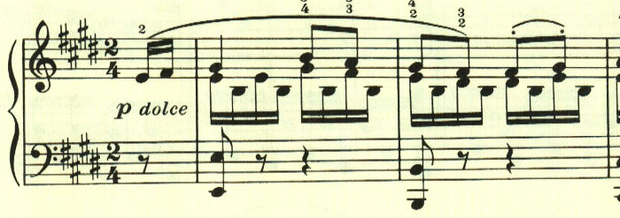
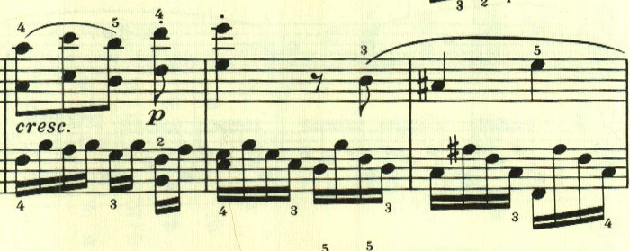
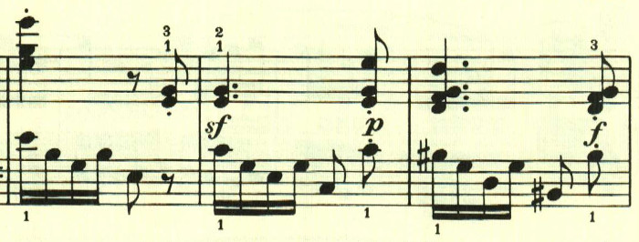
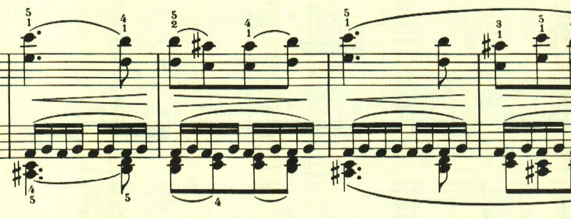
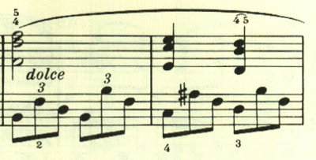
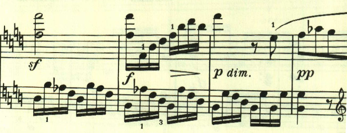
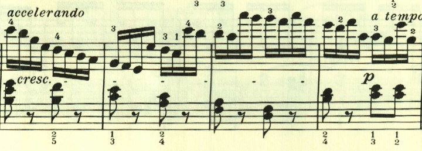

# ベートーヴェン ピアノ・ソナタ 第27番 第2楽章

<iframe allow="autoplay *; encrypted-media *;" frameborder="0" height="150" style="width:100%;max-width:660px;overflow:hidden;background:transparent;" sandbox="allow-forms allow-popups allow-same-origin allow-scripts allow-storage-access-by-user-activation allow-top-navigation-by-user-activation" src="https://embed.music.apple.com/us/album/piano-sonata-no-27-in-e-minor-op-90-ii-nicht-zu-geschwind/947851407?i=947851426&app=music"></iframe>

第2楽章は、優しい旋律に囲まれた夢見るような楽章。それでいて、どこか寂しい雰囲気がただよう。

全体に流れるような雰囲気で、優しい風が吹いているかのよう。

何かを問いかけているのか、あるいは試行錯誤しているかのようだ。

眩しい光の中を進んでいくかのよう。

ゆっくりと歩いていくかのような旋律。

後半、ここで流れは止まり、色彩が消えていくが、またすぐに最初のテーマが帰ってくる。

最後に新しい流れるような旋律が現れて、かわいらしく終わる。

楽譜引用はヘンレ版から。

