# ベートーヴェン ピアノ・ソナタ 第27番

## 第1楽章

<iframe allow="autoplay *; encrypted-media *;" frameborder="0" height="150" style="width:100%;max-width:660px;overflow:hidden;background:transparent;" sandbox="allow-forms allow-popups allow-same-origin allow-scripts allow-storage-access-by-user-activation allow-top-navigation-by-user-activation" src="https://embed.music.apple.com/us/album/piano-sonata-no-27-in-e-minor-op-90-i-mit-lebhaftigkeit/947851407?i=947851425&app=music"></iframe>

第27番も2楽章しかない小規模なソナタ。最初のテーマは葛藤なのか覚悟なのか。

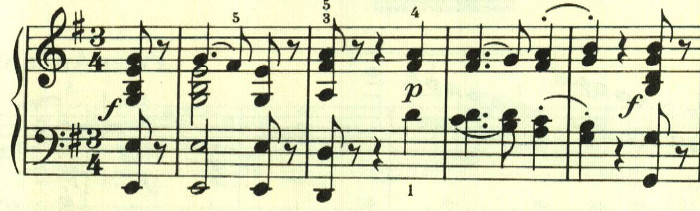

2つ目のテーマは、1つ目に呼応するかのような静かなもの。

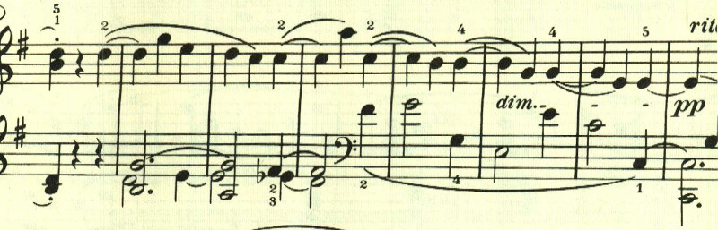

次第にテンポが上がって行き、嘆きを表現するかのような和音が連打される。

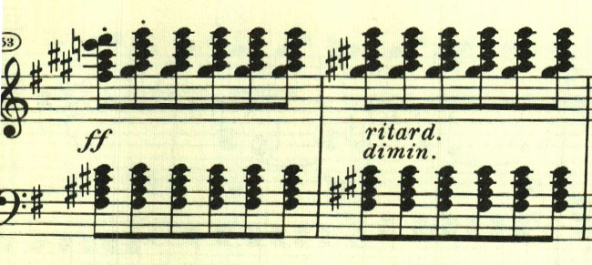

この楽章は10度が頻出する。左手の10度跳躍の上に、右手はテーマになり切れない音型が繰り返される。空虚な心情を表すかのようだ。

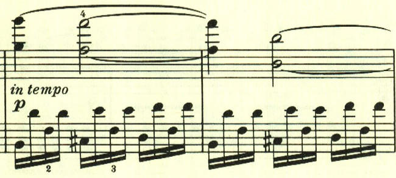

右手の速いとりとめもない動きの上で、左手で2つ目のテーマが奏される。

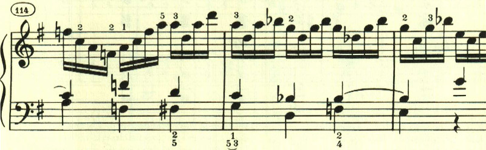

再度最初のテーマに戻る。

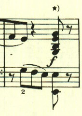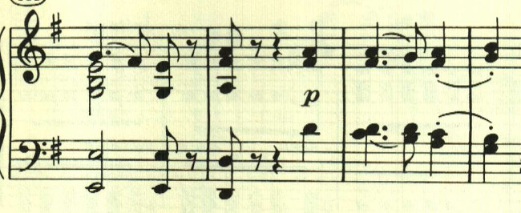

最後は2つ目のテーマがppで繰り返されて静かに終わる。

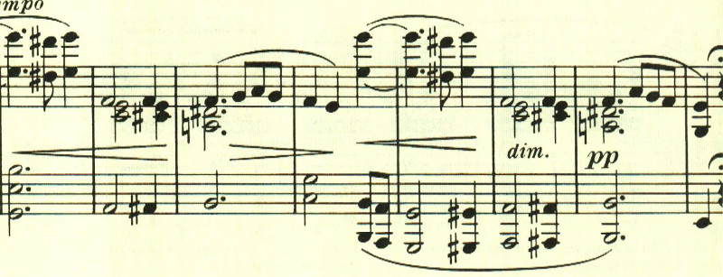

## 第2楽章

<iframe allow="autoplay *; encrypted-media *;" frameborder="0" height="150" style="width:100%;max-width:660px;overflow:hidden;background:transparent;" sandbox="allow-forms allow-popups allow-same-origin allow-scripts allow-storage-access-by-user-activation allow-top-navigation-by-user-activation" src="https://embed.music.apple.com/us/album/piano-sonata-no-27-in-e-minor-op-90-ii-nicht-zu-geschwind/947851407?i=947851426&app=music"></iframe>

第2楽章は、優しい旋律に囲まれた夢見るような楽章。それでいて、どこか寂しい雰囲気がただよう。

全体に流れるような雰囲気で、優しい風が吹いているかのよう。

何かを問いかけているのか、あるいは試行錯誤しているかのようだ。

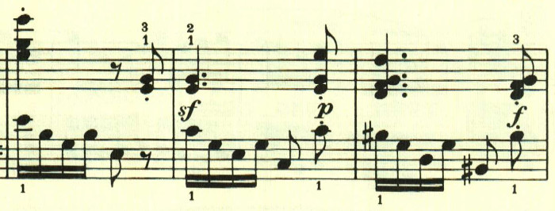

眩しい光の中を進んでいくかのよう。

ゆっくりと歩いていくかのような旋律。

後半、ここで流れは止まり、色彩が消えていくが、またすぐに最初のテーマが帰ってくる。

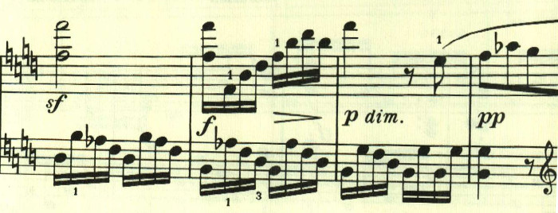

最後に新しい流れるような旋律が現れて、かわいらしく終わる。

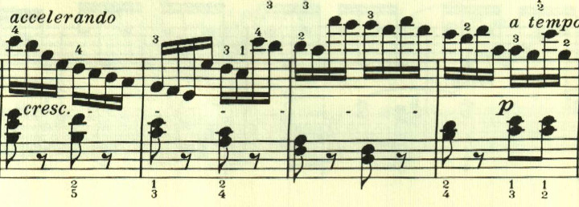

楽譜引用はヘンレ版から。
