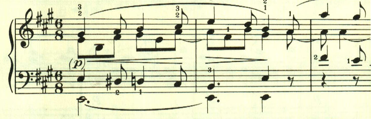
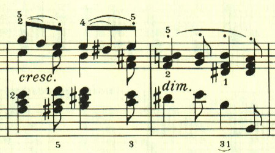
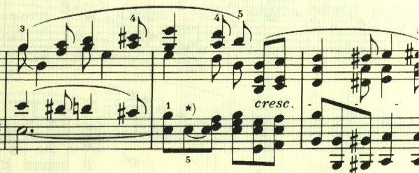

# ベートーヴェン ピアノ・ソナタ 第28番 第1楽章

<iframe allow="autoplay *; encrypted-media *;" frameborder="0" height="150" style="width:100%;max-width:660px;overflow:hidden;background:transparent;" sandbox="allow-forms allow-popups allow-same-origin allow-scripts allow-storage-access-by-user-activation allow-top-navigation-by-user-activation" src="https://embed.music.apple.com/us/album/piano-sonata-no-28-in-major-op-101-i-etwas-lebhaft/1210861834?i=1210862134&app=music"></iframe>

第28番は落ち着いたテーマで構成される小さなソナタ。

この曲では、特徴的なスラーのかかった音型が登場する。

展開部は小規模で、再現部も分かりにくく、幻想的な雰囲気に包まれる。

楽譜引用はヘンレ版から。
