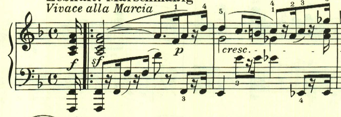
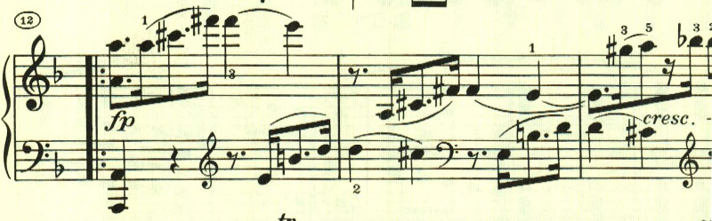
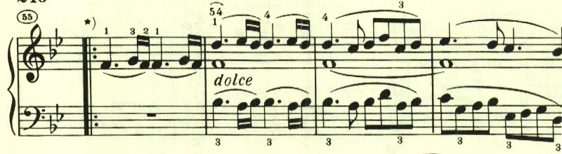
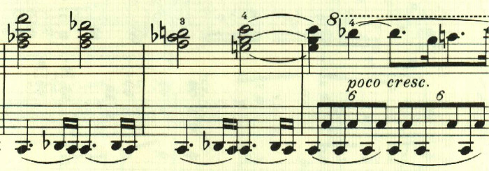

# ベートーヴェン ピアノ・ソナタ 第28番 第2楽章

<iframe allow="autoplay *; encrypted-media *;" frameborder="0" height="150" style="width:100%;max-width:660px;overflow:hidden;background:transparent;" sandbox="allow-forms allow-popups allow-same-origin allow-scripts allow-storage-access-by-user-activation allow-top-navigation-by-user-activation" src="https://embed.music.apple.com/us/album/piano-sonata-no-28-in-major-op-101-ii-lebhaft-marschm%C3%A4%C3%9Fig/1210861834?i=1210862194&app=music"></iframe>

後期ソナタの特徴の1つが第2楽章だ。緩徐楽章は姿を消し、力強い楽章が配置されている。

符点のリズムが特徴的。

印象的なカノンが配置されている。

推移部を伴って最初に戻る。

楽譜の引用はヘンレ版
