# ベートーヴェン ピアノ・ソナタ 第28番 第3楽章

<iframe allow="autoplay *; encrypted-media *;" frameborder="0" height="150" style="width:100%;max-width:660px;overflow:hidden;background:transparent;" sandbox="allow-forms allow-popups allow-same-origin allow-scripts allow-storage-access-by-user-activation allow-top-navigation-by-user-activation" src="https://embed.music.apple.com/us/album/piano-sonata-no-28-in-major-op-101-iii-langsam-und/1210861834?i=1210862227&app=music"></iframe>

第3楽章は序奏の後に第一楽章のテーマが再度奏された後に多声が多用される充実のソナタが続く。

序奏は夕暮れを思わせるかのようなおだやかなテーマで始まる。

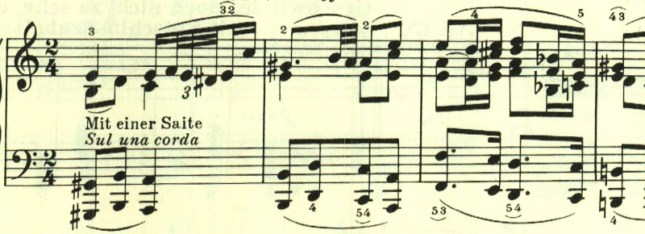

最初のテーマに変化が与えられる。

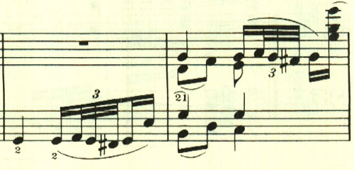

第一楽章のテーマが再度奏される。

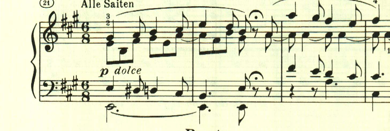

トリルをはさんで、1つ目のテーマ。

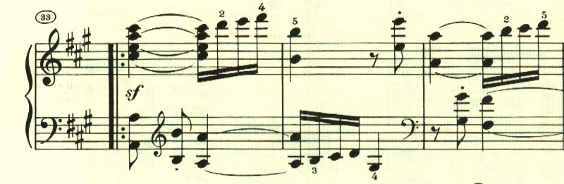

もう1つのテーマ。

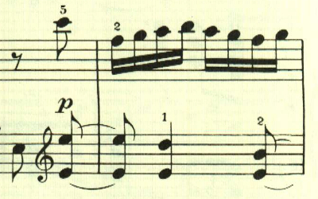

1つ目のテーマの変形。

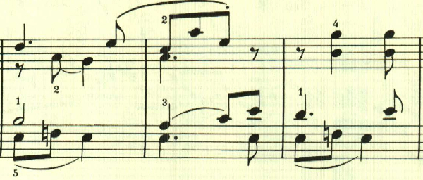

2つ目のテーマの変形。

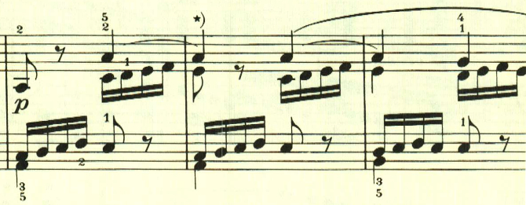

2つ目のテーマの変形。

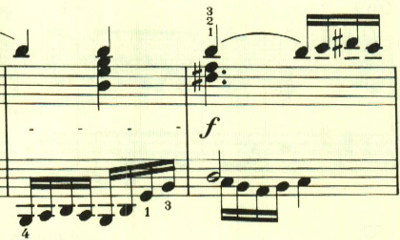

ここで一息。

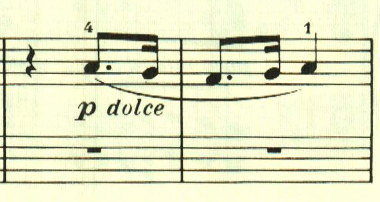

展開部に入るまでにも既にテーマが様々に展開されてきているが、展開部に入ってからは更に多声を駆使した充実ぶり。

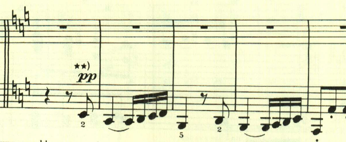

最初のテーマがカノン風に展開される。

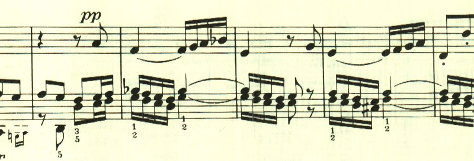

再現部。

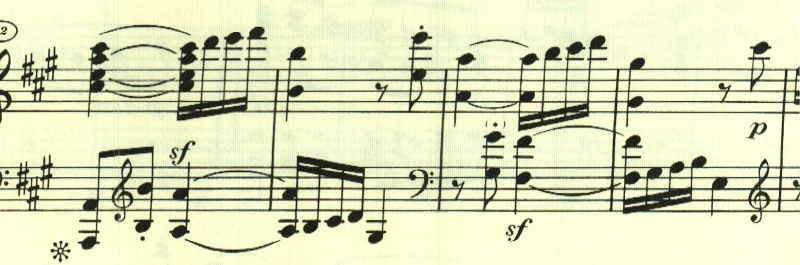

最後はトリルの上に2つ目のテーマが静かに奏される。

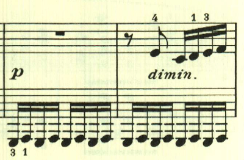

最後はなかば唐突な和音がffで奏されて終わる。

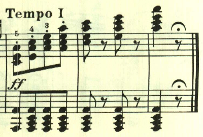

楽譜に引用はヘンレ版から。
