# ベートーヴェン ピアノ・ソナタ 第28番

## 第1楽章

<iframe allow="autoplay *; encrypted-media *;" frameborder="0" height="150" style="width:100%;max-width:660px;overflow:hidden;background:transparent;" sandbox="allow-forms allow-popups allow-same-origin allow-scripts allow-storage-access-by-user-activation allow-top-navigation-by-user-activation" src="https://embed.music.apple.com/us/album/piano-sonata-no-28-in-major-op-101-i-etwas-lebhaft/1210861834?i=1210862134&app=music"></iframe>

第28番は落ち着いたテーマで構成される小さなソナタ。

この曲では、特徴的なスラーのかかった音型が登場する。

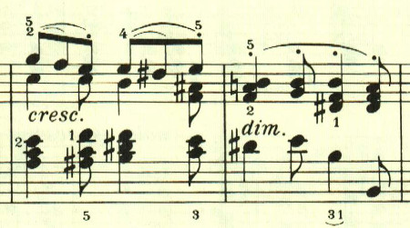

展開部は小規模で、再現部も分かりにくく、幻想的な雰囲気に包まれる。

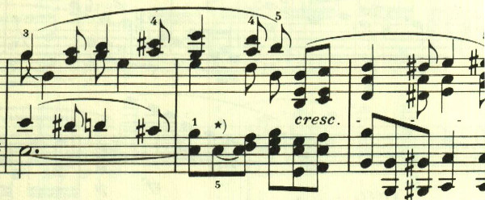

## 第2楽章

<iframe allow="autoplay *; encrypted-media *;" frameborder="0" height="150" style="width:100%;max-width:660px;overflow:hidden;background:transparent;" sandbox="allow-forms allow-popups allow-same-origin allow-scripts allow-storage-access-by-user-activation allow-top-navigation-by-user-activation" src="https://embed.music.apple.com/us/album/piano-sonata-no-28-in-major-op-101-ii-lebhaft-marschm%C3%A4%C3%9Fig/1210861834?i=1210862194&app=music"></iframe>

後期ソナタの特徴の1つが第2楽章だ。緩徐楽章は姿を消し、力強い楽章が配置されている。

符点のリズムが特徴的。

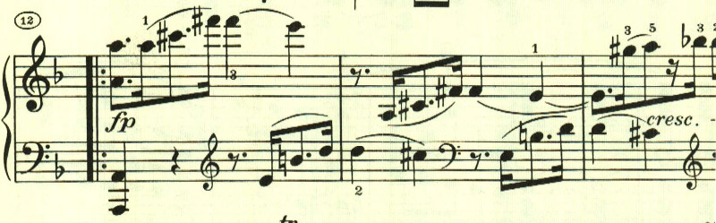

印象的なカノンが配置されている。

推移部を伴って最初に戻る。

## 第3楽章

<iframe allow="autoplay *; encrypted-media *;" frameborder="0" height="150" style="width:100%;max-width:660px;overflow:hidden;background:transparent;" sandbox="allow-forms allow-popups allow-same-origin allow-scripts allow-storage-access-by-user-activation allow-top-navigation-by-user-activation" src="https://embed.music.apple.com/us/album/piano-sonata-no-28-in-major-op-101-iii-langsam-und/1210861834?i=1210862227&app=music"></iframe>

第3楽章は序奏の後に第一楽章のテーマが再度奏された後に多声が多用される充実のソナタが続く。

序奏は夕暮れを思わせるかのようなおだやかなテーマで始まる。

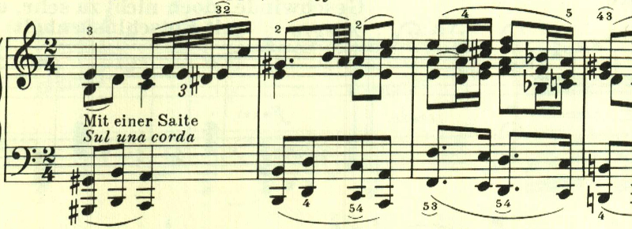

最初のテーマに変化が与えられる。

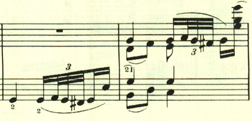

第一楽章のテーマが再度奏される。

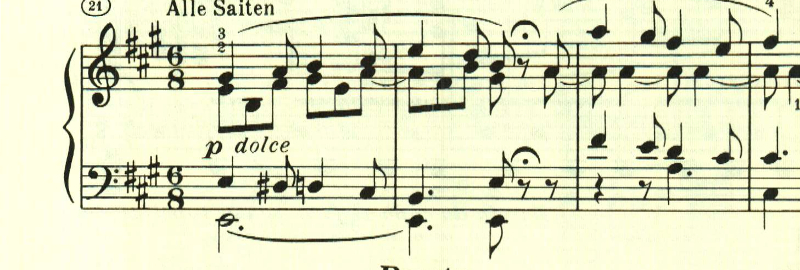

トリルをはさんで、1つ目のテーマ。

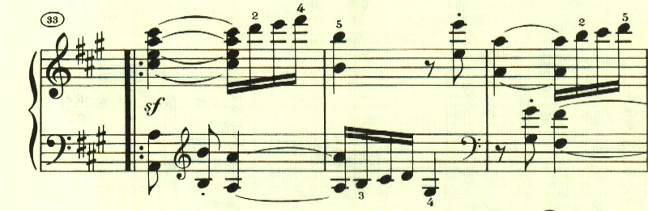

もう1つのテーマ。

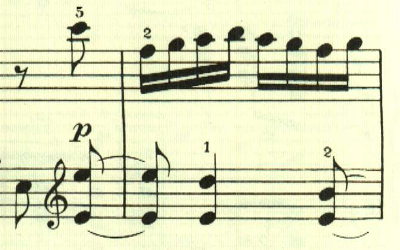

1つ目のテーマの変形。

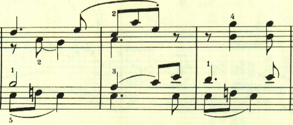

2つ目のテーマの変形。

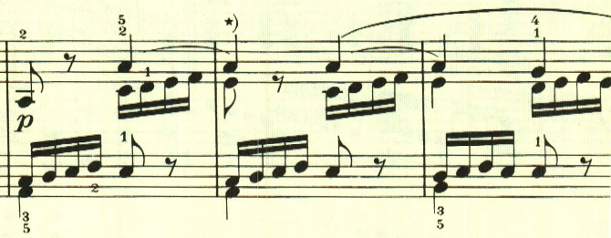

2つ目のテーマの変形。

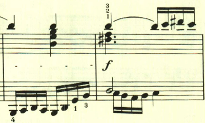

ここで一息。

展開部に入るまでにも既にテーマが様々に展開されてきているが、展開部に入ってからは更に多声を駆使した充実ぶり。

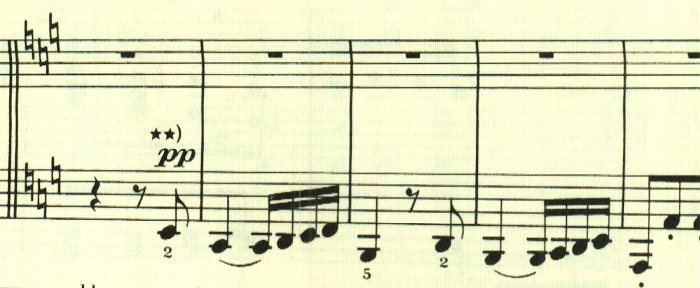

最初のテーマがカノン風に展開される。

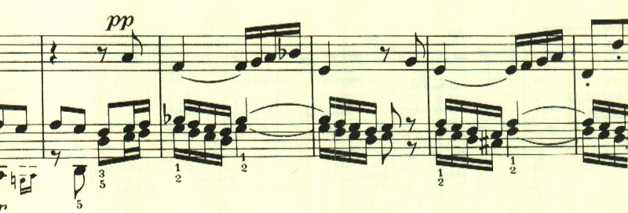

再現部。

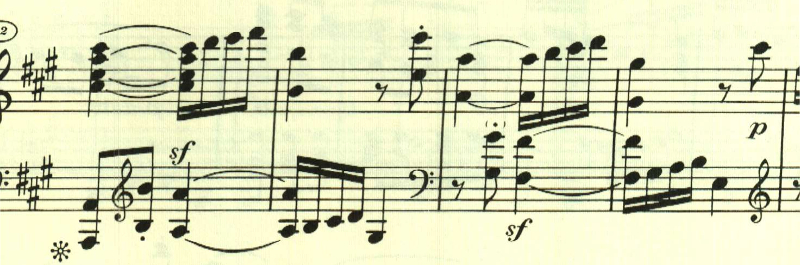

最後はトリルの上に2つ目のテーマが静かに奏される。

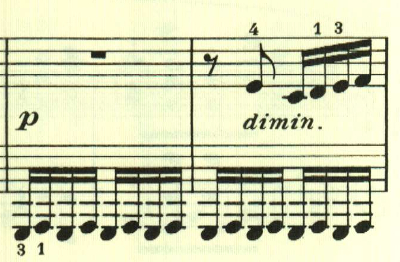

最後はなかば唐突な和音がffで奏されて終わる。

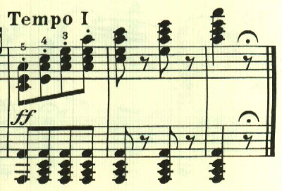

楽譜に引用はヘンレ版から。

